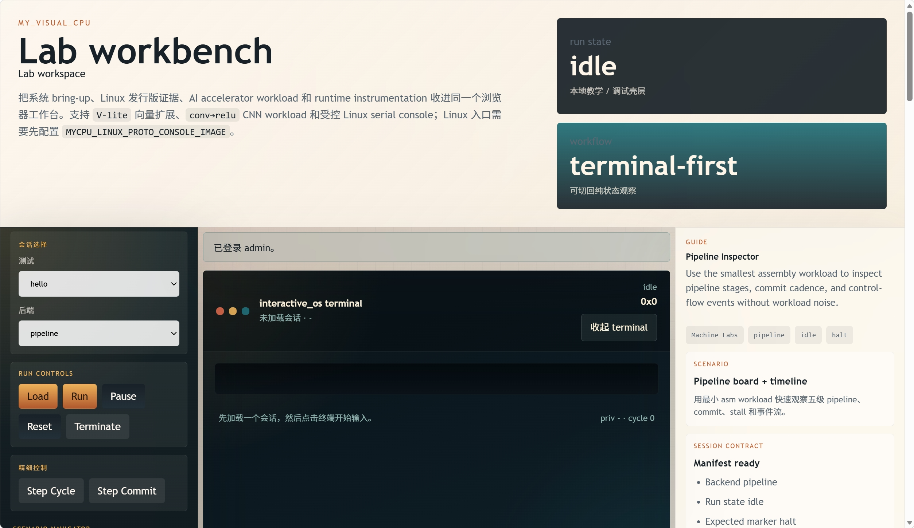

# myCPU — RISC-V 系统模拟器原型

myCPU 是一套从 C 原型持续演进到模块化 C++17 架构的 RISC-V 系统模拟器。当前仓库已经是可运行的模拟器原型，不是纯设计稿：它能运行自制 guest 内核、交互式 monitor、`xv6-riscv` shell、Linux-facing probe，并通过浏览器 Lab 工作台观察 terminal、pipeline、寄存器、CSR、设备和 AI profile。

当前实时状态、active line、近端 blocker 和下一步只看 [docs/status/mainline_status.md](docs/status/mainline_status.md)。课程结题材料集中放在 [docs/showcase](docs/showcase)。



## 当前定位

- **参考优先**：共享 `InstructionSemantics + functional backend` 是 ISA 语义真值来源，`pipeline`、JIT/DBT 原型和前端观察面都围绕它对齐。
- **系统级 bring-up**：已覆盖 M / S / U 特权级、CSR、trap、Sv39、TLB、UART、CLINT、PLIC、块设备和 `virtio-blk` 路径。
- **多后端执行**：`functional` 是正确性基线；`pipeline` 已具备 rename、ROB、LSQ 和最小真实 OoO execute；JIT/DBT 保持 opt-in 原型和 guardrail。
- **可观察实验台**：`mycpu --debug-cli`、Node debug server 和浏览器 `/console` 组成 Lab workbench。
- **Post-Wave 7 继续开发**：本地工作区已进入两条新主线：标准 Linux 发行版平台，以及用户自定义 AI 任务 / NPU 性能模型。

## 能力快照

| 维度 | 当前状态 |
|---|---|
| ISA / 语义 | RV64I / RV64M 为主体，按 workload 需求补齐 compressed、atomic、浮点子集、V-lite 与设备相关路径 |
| 执行后端 | `functional` reference；`pipeline` 支持 rename / ROB / LSQ / OoO observation；JIT/DBT 为 opt-in harness |
| 特权 / 内存 | M / S / U、trap delegation、`mret/sret`、Sv39、TLB、`sfence.vma`、page fault |
| 平台设备 | UART、CLINT、PLIC、SimpleStorage、`virtio-blk`、MMIO AI accelerator |
| Guest | `kernel_alpha` 课程 OS 第一阶段、`interactive_os`、`xv6-riscv` shell、Linux-facing console/probe |
| Linux 发行版线 | 外部 Alpine / Debian rootfs 走 opt-in runtime 合同；仓库默认不携带真实 `Image/rootfs` |
| AI 线 | task spec importer、bounded dynamic GEMM/CNN/tiny model、guest bridge、timed-simple profile summary |
| 前端 | `/` 产品首页、`/console` Lab workbench、`/docs` 产品文档入口 |
| 验证 | asm、unit、host smoke、guest smoke、pipeline、frontend、Spike differential smoke |

## 快速开始

安装常用依赖：

```bash
sudo apt install gcc-riscv64-unknown-elf binutils-riscv64-unknown-elf nodejs npm
```

构建模拟器：

```bash
cd myCPU
make
```

运行 ELF 或 flat binary：

```bash
cd myCPU
./mycpu <program.elf>
./mycpu --backend pipeline <program.elf>
./mycpu -b 80000000 <program.bin>
```

启动浏览器 Lab：

```bash
cd myCPU && make
cd ..
node frontend/server/debug_server.mjs --port=4173
```

打开：

- `http://127.0.0.1:4173/`
- `http://127.0.0.1:4173/console`
- `http://127.0.0.1:4173/docs`

## 常用验证

```bash
cd myCPU
make test
make test-pipeline
make test-host-debug_cli_smoke
make test-host-run_debug_cli_probe
make test-host-xv6_boot_smoke
make test-host-xv6_shell_smoke
```

前端验证：

```bash
cd frontend
node --test
```

AI demo v1：

```bash
cd myCPU
python3 workloads/ai_proto/run_demo_v1.py --out-dir workloads/ai_proto/generated/demo_v1
```

Spike 外部差分是 opt-in 能力，未安装 Spike 时不影响默认测试：

```bash
cd myCPU
make test-host-spike_differential_smoke
SPIKE_PATH=/path/to/spike make test-host-spike_differential
```

真实 Linux / 发行版 runtime 需要外部资产，仓库默认保持 fail-closed。相关环境变量和路线见 [docs/status/linux_distribution_platform_status.md](docs/status/linux_distribution_platform_status.md) 与 [deploy/README.md](deploy/README.md)。

## 仓库结构

```text
my_visual_CPU/
├── AGENTS.md          # 仓库规则、开发工作流和验证基线
├── myCPU/             # 模拟器主体、guest runtime、workloads、测试和 Makefile
├── frontend/          # Node debug server、浏览器前端和 Node 测试
├── docs/              # background / design / plan / status / showcase
├── deploy/            # 远端单机部署支架和 smoke 脚本
└── README.md
```

## 文档入口

- [docs/index.md](docs/index.md)：正式文档总入口。
- [docs/status/mainline_status.md](docs/status/mainline_status.md)：仓库唯一主线实时状态。
- [docs/status/linux_distribution_platform_status.md](docs/status/linux_distribution_platform_status.md)：Post-Wave 7 标准 Linux 发行版平台状态。
- [docs/status/npu_tpu_accelerator_status.md](docs/status/npu_tpu_accelerator_status.md)：AI accelerator / NPU-like 方向状态。
- [docs/design/post_wave7_frontend_lab_product_design.md](docs/design/post_wave7_frontend_lab_product_design.md)：当前 Lab workbench 设计边界。
- [docs/showcase/README.md](docs/showcase/README.md)：课程结题、PPT、讲稿、截图和展示页入口。

## 展示材料

课程结题和对外展示材料已经统一收口到 [docs/showcase](docs/showcase)：

- 结题 PPT：`docs/showcase/myCPU_结题汇报.pptx`
- 十分钟演讲稿：`docs/showcase/myCPU_结题汇报_十分钟演讲稿.md`
- 结题报告：`docs/showcase/结题报告-梁家琦-20231071332-电计2304.md`
- HTML 预览页：`docs/showcase/preview.html`

这些材料只服务汇报与展示，不替代 `docs/status/mainline_status.md` 的实时工程事实。
