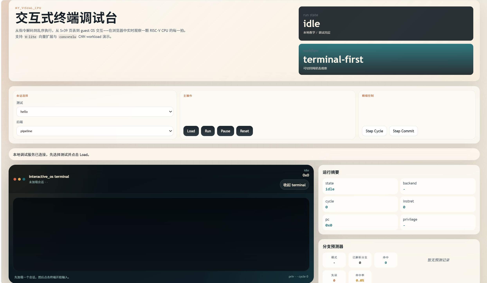
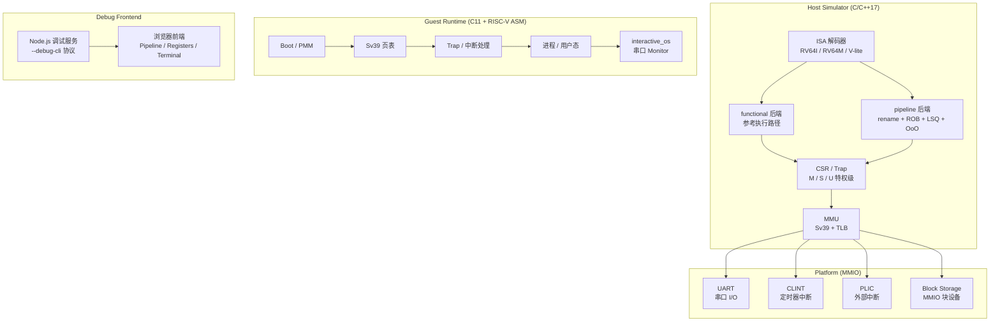

# myCPU — RISC-V 模拟器原型

一套从零开始、独立设计的 RISC-V 系统模拟器，已经可以运行自制的小型操作系统内核。

<!-- 如果已有截图，取消下面的注释 -->
<!--  -->

## 核心亮点

- **完整的指令集与特权级**：RV64I / RV64M 基础指令，M / S / U 三级特权模式，完整 trap / 异常处理链路
- **双执行后端**：`functional`（参考执行）与 `pipeline`（乱序执行：rename + ROB + LSQ + OoO execute）
- **Sv39 虚拟内存**：三级页表、TLB、`sfence.vma`，支持完整的 page fault 语义
- **最小硬件平台**：UART 串口、CLINT 定时器、PLIC 中断控制器、MMIO 块设备
- **自制 OS 内核**：从 boot 到 PMM、页表建立、中断处理、用户态进程、存储读取的完整 bring-up
- **外部 workload bring-up**：`xv6-riscv` 已能在真实 `virtio-blk` board path 上稳定到 shell，Linux-facing boot path 已具备 generic `flat image + payload + set_gpr` foundation
- **向量扩展与 ML**：V-lite 指令子集，支持 dot / GEMM / Conv / ReLU，可运行固定 conv→relu CNN demo
- **浏览器可视化前端**：Pipeline 时序图、寄存器/CSR 实时观察、交互式终端、向量寄存器面板
- **工业级验证体系**：259 个测试文件、39 个 make test 目标、Spike 外部差分验证

## 系统架构



## 核心能力矩阵

| 能力维度 | 当前状态 | 说明 |
|---------|---------|------|
| 基础 ISA | RV64I + RV64M | 完整整数与乘除法指令 |
| 向量扩展 | V-lite 子集 | vsetcfg / vle / vse / vadd / vmul / vmax / vdot |
| 执行后端 | functional + pipeline | pipeline 含 rename / ROB / LSQ / OoO execute |
| 特权级 | M / S / U | 完整 trap delegation、mret / sret |
| 虚拟内存 | Sv39 | 三级页表、TLB、sfence.vma、page fault |
| 平台设备 | 4 种 | UART / CLINT / PLIC / Block Storage |
| Guest OS | kernel_alpha | boot → PMM → 页表 → 中断 → 用户态 → 存储 |
| 交互 Monitor | interactive_os | help / echo / time / regs / pagewalk / disk 等命令 |
| 可视化前端 | 浏览器调试台 | Pipeline 时序 / 寄存器 / Terminal / 向量面板 |
| 测试覆盖 | 259 文件 / 39 targets | asm / host / guest / pipeline / frontend |
| 外部验证 | Spike 差分 | myCPU vs Spike final-state oracle |

## 项目规模

| 指标 | 数值 |
|-----|------|
| Host 模拟器 C/C++ 代码 | ~41,000 行 |
| Guest 运行时代码 | ~10,000 行 |
| 前端 JavaScript 代码 | ~6,000 行 |
| 设计与状态文档 | 26 篇 |
| 测试文件 | 259 个 |
| Git 提交 | 156 次 |

## 仓库结构

```text
my_visual_CPU/
├── myCPU/          # 模拟器主体、guest runtime、测试与 Makefile
│   ├── src/        #   simulator C/C++ 源码
│   ├── guest/      #   guest runtime（C11 + RISC-V asm）
│   └── tests/      #   asm / host / guest 测试
├── frontend/       # 本地调试服务、浏览器前端与 Node 测试
│   ├── server/     #   Node.js 调试服务
│   └── app/        #   浏览器前端（vanilla JS）
├── docs/           # background / design / plan / status 文档与 showcase 展示材料
└── README.md
```

更细的模块说明：

- [AGENTS.md](AGENTS.md) — 项目总览与开发约定
- [myCPU/AGENTS.md](myCPU/AGENTS.md) — 模拟器主体模块边界
- [myCPU/guest/AGENTS.md](myCPU/guest/AGENTS.md) — Guest runtime 层次说明

## 快速开始

### 依赖

```bash
sudo apt install gcc-riscv64-unknown-elf binutils-riscv64-unknown-elf
```

### 构建

```bash
cd myCPU
make
```

### 运行

```bash
cd myCPU

# 运行 ELF
./mycpu <program.elf>

# 使用 pipeline 后端
./mycpu --backend pipeline <program.elf>

# 运行平坦二进制
./mycpu -b 80000000 <program.bin>
```

### 启动浏览器前端

```bash
cd myCPU && make          # 先构建
cd ..
node frontend/server/debug_server.mjs
# 打开 http://127.0.0.1:4173
```

前端支持：选择 demo → 切换后端 → Load / Run / Pause / Step → 查看 Pipeline / Registers / Terminal / 向量面板

## `interactive_os` 交互演示

`interactive_os` 是一条"浏览器终端 + guest 串口 monitor"的完整交互闭环。当前 monitor 支持的命令：

`help` · `echo` · `time` · `uptime` · `disk info` · `disk read <lba>` · `regs` · `peek <addr>` · `pagewalk <addr>` · `pte dump <addr>` · `halt`

## 外部 workload

当前主工作区还维护了一条面向真实 guest 的外部 workload bring-up 路径：

- `run-workload-xv6` 会在 `mycpu_virt + virtio-blk` board profile 上启动 `xv6-riscv`；当前已稳定到 shell，并有 host smoke 锁住 shell prompt、基础文件系统操作、`forktest` 和 `stressfs`。
- Linux-facing boot foundation 已支持 generic `flat image + payload + set_gpr`；`linux_proto` profile 可以稳定导出 `Image`、`dtb`、`initrd` 与启动寄存器布局，作为下一步真实 Linux 接入的最小板级合同。

## 测试

```bash
cd myCPU
make test              # functional reference path 全量回归
make test-pipeline     # pipeline backend 全量回归
make test-host-run_debug_cli_probe
make test-host-xv6_boot_smoke
make test-host-xv6_shell_smoke
make run-workload-xv6

cd ../frontend
node --test            # 前端 Node 测试
```

<details>
<summary>定向验证目标（点击展开）</summary>

```bash
cd myCPU
# Debug / Pipeline
make test-host-debug_cli_smoke
make test-host-pipeline_rename_commit_smoke
make test-host-pipeline_speculation_contracts_smoke
make test-host-interactive_terminal_smoke

# Guest
make test-guest-kernel_alpha_demo
make test-guest-kernel_alpha_fault_demo
make test-guest-interactive_os_demo

# 向量
make test-host-vector_vlite_smoke
make test-host-vector_backend_smoke
make test-host-vector_cnn_smoke
```

</details>

<details>
<summary>Spike 外部差分验证（点击展开）</summary>

Spike 差分是独立离线能力，用于提供 `myCPU vs Spike` 的外部 oracle。不是默认门禁，未装 Spike 时不影响正常测试。

```bash
cd myCPU

# 只跑本地 helper 自测（不需要 Spike）
make test-host-spike_differential_smoke

# 真实差分（需要 Spike）
make test-host-spike_differential

# 指定 Spike 路径
SPIKE_PATH=/path/to/spike make test-host-spike_differential
```

当前已覆盖：基础 ALU / control-flow / trap / delegated privilege，以及 Sv39 page fault final-state 子集。

</details>

## 技术栈

| 层 | 技术 |
|----|------|
| Host 模拟器 | C + C++17 |
| Guest 运行时 | C11 + RISC-V assembly |
| 构建系统 | GNU Make |
| 交叉工具链 | `riscv64-unknown-elf-gcc` / `riscv64-unknown-elf-objcopy` |
| 前端 | 原生 JavaScript（无框架） |
| 调试服务 | Node.js |
| 文档 | Markdown |

## 文档入口

快速了解当前状态，建议按下面顺序看：

1. [docs/index.md](docs/index.md)
2. [docs/status/mainline_status.md](docs/status/mainline_status.md)
3. [docs/status/kernel_alpha_status.md](docs/status/kernel_alpha_status.md)
4. [docs/status/npu_tpu_accelerator_status.md](docs/status/npu_tpu_accelerator_status.md)

设计文档：

- [docs/design/debug_frontend_integration.md](docs/design/debug_frontend_integration.md)
- [docs/design/minimal_interactive_os_design.md](docs/design/minimal_interactive_os_design.md)
- [docs/design/phase3_ooo_execution_model_design.md](docs/design/phase3_ooo_execution_model_design.md)
- [docs/design/pipeline_speculation_contracts.md](docs/design/pipeline_speculation_contracts.md)
- [docs/design/vector_ml_workload_direction_design.md](docs/design/vector_ml_workload_direction_design.md)
- [docs/design/phase4_preparation_design.md](docs/design/phase4_preparation_design.md)
- [docs/design/future_expansion_roadmap_design.md](docs/design/future_expansion_roadmap_design.md)

完整展示材料见 [docs/showcase/README.md](docs/showcase/README.md)，HTML 预览页见 [docs/showcase/preview.html](docs/showcase/preview.html)。
