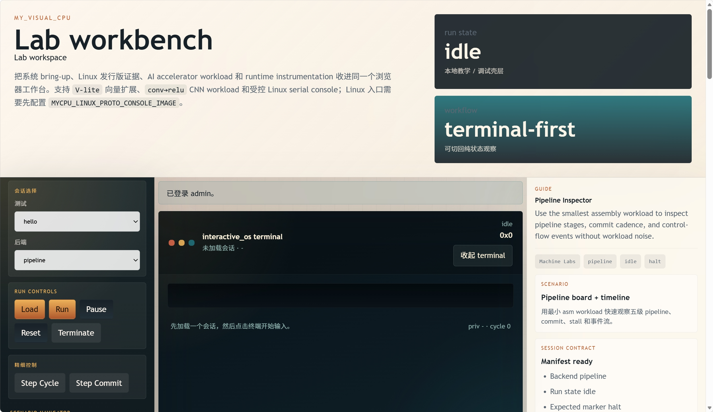

# myCPU：RISC-V 系统模拟器

myCPU 是一个已可运行的 RISC-V 系统模拟器原型，采用模块化 C++17 架构。
项目围绕指令语义、执行模型、系统 workload、设备与可观察性演进，不再以课程项目定性。
浏览器 Lab、guest runtime 和 Course OS 等现有能力仍是模拟器的运行与验证资产。

当前工作看 [docs/current.md](docs/current.md)，待办由
[GitHub Issues](https://github.com/steven123397/my_visual_CPU/issues) 承载。
开发流程采用 NexusKit，架构与技术契约见 [GitHub Wiki](https://github.com/steven123397/my_visual_CPU/wiki)。



## 能力与边界

| 维度 | 已有能力 |
|---|---|
| 指令语义 | RV64I / M 为主体，含 workload 驱动的 compressed、atomic、浮点子集和 V-lite |
| 执行后端 | `functional` 是共享 ISA 语义的 reference；`pipeline` 包含 rename、ROB、LSQ 和最小 OoO 执行 |
| 特权与内存 | M / S / U、CSR、trap、Sv39、TLB、page fault |
| 设备 | UART、CLINT、PLIC、storage、virtio-blk、MMIO AI accelerator |
| 系统 workload | guest runtime、Course OS shell、interactive monitor、xv6 和受控 Linux 路径 |
| AI | 受限 task spec、bounded dynamic workload、设备 timing / profile |
| 调试 | debug CLI、Node 服务、浏览器 Lab 工作台 |

以上是已有实现概览，不代表完整 ISA、通用 Linux 发行版或商用 NPU 支持。
JIT / DBT 保持 opt-in 研究资产；真实 Linux / 发行版镜像与 Spike 需要外部资产。
Wiki 区分现行契约、历史验证与未验证能力，历史结果不能替代本轮实跑证据。

## 构建与运行

常用依赖包括 C++17 编译器、Make、Python 3、Node.js 和 RISC-V 裸机工具链。
构建模拟器：

```bash
cd myCPU
make
./mycpu <program.elf>
./mycpu --backend pipeline <program.elf>
./mycpu -b 80000000 <program.bin>
```

启动浏览器 Lab：

```bash
node frontend/server/debug_server.mjs --port=4173
```

入口为 `http://127.0.0.1:4173/`、`/console` 和 `/docs`。
前端配置见 [frontend/README.md](frontend/README.md)，部署配置见 [deploy/README.md](deploy/README.md)。

## 验证入口

按改动选择能覆盖行为与边界的门禁：

```bash
cd myCPU
make -j2 build-ci-core
make -j1 test-ci-core
make test-unit-all
make test-fast-smoke
make test-standard-regression
make test
make test-pipeline
```

前端测试：

```bash
# 先在仓库根目录准备真实联调资产
make -C myCPU -j2 mycpu tests/asm/hello.elf guest/interactive_os.elf guest/course_os_shell.elf
cd frontend
node --test
```

仓库提供 [日常 CI 配置](.github/workflows/ci.yml)（PR、推送 main、手动）和
[手动完整回归配置](.github/workflows/regression.yml)（标准 functional / pipeline 回归及 xv6 shell）。
两份 workflow 已启用并通过云端验收，版本、run 与证据范围见 [当前进度](docs/current.md)。首次手动运行需要 workflow 已进入默认分支。
日常环境为 Ubuntu 24.04 x86-64，前端使用 Node 24；日志 artifact 保留 14 天。

发布后可指定分支或 tag 运行，并取回精确 run 的结果：

```bash
gh workflow run regression.yml --ref <branch-or-tag>
gh run list --workflow regression.yml --branch <branch> --limit 5
gh run view <run-id> --attempt <attempt> --json headSha,event,status,conclusion,jobs,url
gh run watch <run-id> --exit-status
gh run download <run-id> --name 'Full regression-regression-<run-id>-<attempt>' --dir /tmp/mycpu-ci-evidence
```

核对实际 checkout SHA（PR 默认为合并提交）、run ID 和 attempt 后，广泛回归可复用该版本的云端证据；
失败、取消、外部场景 skip 和尚未运行的任务不能计为通过。各任务摘要及下载日志包含环境版本和阶段结果。

慢速 guest 与外部资产验证分别使用 `make test-slow-guest` 和
`make test-opt-in-external`，运行前确认具体目标及资产要求。

## 仓库入口

- [AGENTS.md](AGENTS.md)：最小项目指引。
- [myCPU/](myCPU)：模拟器、guest、workload 与测试。
- [frontend/](frontend)：浏览器工作台与本地调试服务。
- [docs/current.md](docs/current.md)：当前现场。
- [GitHub Wiki](https://github.com/steven123397/my_visual_CPU/wiki)：架构与技术契约。
- [deploy/](deploy)：部署支架。

旧课程展示、背景、状态和计划已清理，历史内容可通过 Git 查询。
旧设计已提炼为 Wiki 专题；逐文件去向见 [迁移记录](https://github.com/steven123397/my_visual_CPU/wiki/Migration)。
