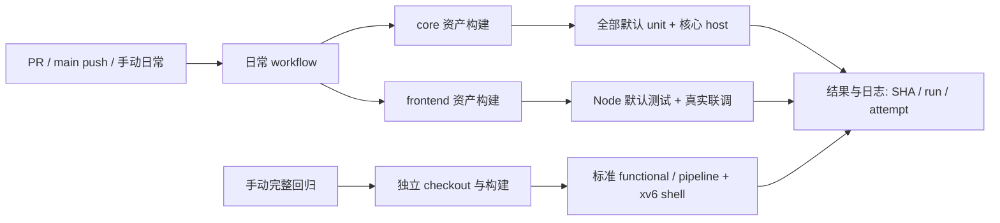

# GitHub Actions 云端验证 - Plan

## Goal Capsule

Objective: 开发者提交代码后能获得可信的云端回归结果，并能按需把完整回归从本机转移到 GitHub。

Means: GitHub Actions 标准托管 runner 与仓库 Make 测试入口（KTD1、KTD2）。

权威顺序：用户最新决定、根 AGENTS、实际实现与测试、当前 Wiki。出现测试失败被吞掉、必需测试被跳过、无法关联验证提交或环境不支持现有测试时，停止声称交付完成并报告具体缺口。

---

## Product Contract

### Summary

建立日常 CI 和手动完整回归两条 workflow。日常 CI 覆盖核心模拟器与浏览器调试链路，完整回归承载较重验证；保持本地 Make 入口可用。

### Problem Frame

本机 CPU 性能限制了广泛验证的反馈速度。项目已有成体系的测试，但尚无 CI，结果依赖开发者本地环境和已有构建资产。

### Requirements

R1. 日常 CI 在 PR、推送 main 和手动触发时运行，验证干净环境中的构建、全部默认单元测试、核心语义、pipeline / functional 差分和前端默认测试。

R2. 手动完整回归覆盖现有 functional / pipeline 标准回归及 xv6 shell，以独立结果保留较重验证证据。

R3. 核心测试失败、超时或构建资产缺失必须产生失败结果；取消与显式外部场景跳过不得报告为测试通过。

R4. 云端结果包含实际 head SHA、run ID / attempt、环境版本、各任务结果与可下载日志，开发者和 Agent 可通过 GitHub 页面及 gh CLI 读取同一证据。

R5. 本地保留相关范围验证，广泛回归可由已发布代码的 CI 承担；不要求在本机重复执行已适用且可追溯的云端结果。

### Key Decisions

采用 GitHub Actions 承载持续验证并减轻本机负担，优于继续完全依赖本地回归；用户已接受先整理测试入口再接入的建议（session-settled: user-approved）。Governs R1、R2、R5。

### Scope Boundaries

本轮实施范围为测试入口、两份 workflow、关联元测试与最小指引更新。模拟器语义及产品功能不变；旧门禁仍可单独调用。

#### Deferred to Follow-Up Work

定时回归、真实 Linux / 发行版 / OSComp / Spike 资产供应、ccache 与跨 job 构建产物复用、多平台矩阵、Codespaces、发布部署和 branch protection 留待后续。首轮不新增服务器或 Agent 框架。

---

## Planning Contract

### Key Technical Decisions

KTD1. 使用固定系统代际的 ubuntu-24.04 x86-64 标准托管 runner，应用 Node 使用 24。显式安装 C/C++ 编译工具、Make、Python、RISC-V bare-metal GCC/binutils 与 dtc，输出实际版本。该环境支持当前 SysV DBT 研究资产；系统标签固定不等于所有预装包版本不变。公开仓库使用标准托管 runner 免费，首轮无需配置额外机器。

KTD2. 新增 `test-unit-all`、`test-ci-core`、`build-ci-core` 三个入口，保留现有测试 target。前者消费 `UNIT_TEST_NAMES` 并运行对应 `test-unit-*`；核心列表只在 Makefile 维护，workflow 调用入口。构建入口必须覆盖核心测试所需二进制与 guest 前置，避免靠测试阶段临时编译弥补缺漏。

核心 host 列表为 instruction_semantics_smoke（含 split FP）、rvc_semantics_smoke、atomic_semantics_smoke、predictor_smoke、pipeline_backend_smoke（含 split FP）、pipeline_core_state_smoke、pipeline_forwarding_smoke、pipeline_commit_trace_smoke、pipeline_rename_commit_smoke、pipeline_speculation_contracts_smoke、backend_differential_smoke、debug_protocol_command_smoke、debug_cli_smoke、execution_profile_smoke、vector_pipeline_smoke、ai_tensor_golden_ops_smoke。名称均指现有 `test-host-*` target，不让核心入口依赖全部 HOST_TEST_BINS。

KTD3. 日常 workflow 有 `simulator-core` 与 `frontend` 两个独立 job，各自 checkout 并构建。核心构建先采用 2 路并行，测试 Make 使用串行；前端先构建 mycpu、hello.elf、interactive_os.elf、course_os_shell.elf，再执行完整默认 Node 测试。首轮不用缓存或跨 job artifact 传递，先获得冷构建基线；后续优化须保留相同测试执行。

KTD4. 完整 workflow 仅手动触发，在一个 job 内串行执行 `test-standard-regression` 和额外 `test-host-xv6_shell_smoke`。不再整套追加 `test-slow-guest`，因为标准回归已经覆盖其大部分 guest；run-workload-xv6 仍是本地体验入口，不作为重复 CI gate。xv6 使用仓库已跟踪源码，上游 SHA 是来源标识，不是构建时下载要求。

KTD5. 日常 workflow 不做路径过滤，检查名称稳定。只取消同一 PR 的旧运行；main 与手动运行使用独立 run ID 分组，避免新提交替换尚未启动的旧验证。完整回归不互相取消。核心 / 前端 job 初始超时为 45 / 30 分钟，完整回归为 120 分钟；这是初始资源上限，实际耗时在首次云端运行后记录。

KTD6. workflow 显式只读权限，PR 使用 pull_request；checkout 不保留凭据。官方 Action 采用当时受支持版本并固定完整 commit SHA，注释标明 release。测试步骤不设 continue-on-error；日志通过 bash pipefail 保留真实退出码，失败时仍上传，artifact 每 job 唯一且保留 14 天。首轮只上传验证日志与环境摘要，不上传外部镜像或部署信息。

KTD7. 手动运行选择 branch/tag，取回结果时显式关联 run ID、attempt 与实际 head SHA。首次 workflow_dispatch 激活依赖 workflow 进入默认分支，不能把新开发分支上的 YAML 当作已可手动运行。主仓库发布是独立动作，本轮规划不推送、合并或修改远端规则。

### Evidence

- `myCPU/Makefile`：test-fast-smoke 只构建 UNIT_TEST_BINS，执行的 host 集有限；test-standard-regression 组合 test 与 test-pipeline。test-unit-% 已有 timeout 和非零退出传播，可直接复用。
- `frontend/tests/debug_server_e2e.test.mjs`：前三项默认 e2e 调用真实 simulator 与三个 guest 映像；仅真实 Linux console 显式 opt-in。
- `myCPU/workloads/xv6/profile.mk`、`myCPU/external/xv6-riscv/`：xv6 vendored 源码和工具链参数现成。
- `myCPU/tests/host/ai_accelerator_profile_smoke.cpp` 使用固定临时目录；`myCPU/tests/host/run_debug_cli_probe_test.py` 会重建公共 Linux 镜像与 DTB，支持串行测试选择。
- GitHub 仓库为 PUBLIC，Actions 已启用，默认 workflow token 为 read，未要求 SHA pinning；本方案主动限制权限并 pin Action。
- 没有 docs/solutions 语料或现成 workflow 可复用。本轮调研没有运行构建或测试，也没有云端耗时数据。

### High-Level Design

每个 job 内先构建后测试，测试失败保持失败结论。不同 job 使用不同 runner 工作区。

### Risks and Dependencies

干净 Ubuntu 上的工具链兼容和现有 3 秒级 host timeout 尚未实跑；实现时区分真正失败、编译问题与 runner 争用，不默认放宽超时或跳过场景。旧 Make 隐含依赖可能只在干净构建暴露，应在 U1 / U2 修正测试构建前置，避免携带本机产物。

首次远端运行需要发布 workflow 的授权与可用默认分支。该条件不阻断本地实施 U1 / U2；U3 的远端验收须在发布后完成，不能以静态检查替代。当前 main 的 5 个本地提交尚未推送，不擅自夹带发布。

### Open Questions

无阻断当前规划或本地实施的问题。云端冷构建耗时、Node24 兼容结果、具体 timeout 调整与 Action release SHA 在实现时确认；定时频率和外部资产管理不在当前决定范围。

### Sources

- [Runner 规格与环境](https://docs.github.com/en/actions/reference/runners/github-hosted-runners)，用于 KTD1。
- [Actions 权限、过滤与 shell 行为](https://docs.github.com/en/actions/reference/workflows-and-actions/workflow-syntax)，用于 KTD5、KTD6。
- [并发控制](https://docs.github.com/en/actions/how-tos/write-workflows/choose-when-workflows-run/control-workflow-concurrency)，用于 KTD5。
- [Action SHA 固定](https://docs.github.com/en/actions/reference/security/secure-use#using-third-party-actions)，用于 KTD6。
- [官方 checkout](https://github.com/actions/checkout)、[setup-node](https://github.com/actions/setup-node)、[upload-artifact](https://github.com/actions/upload-artifact)，用于 KTD1、KTD6。
- [workflow_dispatch 与 schedule](https://docs.github.com/en/actions/reference/workflows-and-actions/events-that-trigger-workflows)，用于 KTD7 及推迟定时回归。
- [gh workflow run](https://cli.github.com/manual/gh_workflow_run)、[gh run watch](https://cli.github.com/manual/gh_run_watch)、[gh run download](https://cli.github.com/manual/gh_run_download)，用于 R4、KTD7。

---

## Implementation Units

### U1. 建立明确的 CI 测试入口

Goal: 提供实际执行全部默认 unit 的核心验证入口，以及可独立准备资产的构建入口。

Requirements: R1、R3；Dependencies: 无。

Files: `myCPU/Makefile`、新建 `myCPU/tests/host/ci_targets_test.py`。

Approach: 按 KTD2、KTD3 复用默认名单与原 host / unit runner。元测试验证核心依赖图覆盖、构建前置与外部 gate 排除，不复制整个测试名单。旧目标保留现有语义。

Patterns to follow: test-unit-%、RUN_HOST_TEST_BINARY、已有 host Python 测试和 test-verification-layers。

Test Scenarios: 默认 UNIT_TEST_NAMES 的每项出现在执行图；split FP 与 debug guest 前置具备；核心不带入 xv6/外部资产 gate；隔离工作区中故意使一个 unit 返回非零或超时，聚合入口必须失败；无现成 ELF 的干净构建后，核心测试成功。

Verification: 核心 gate 实跑并产生各 unit / host 输出；新元测试通过；既有分层入口仍可解析。

### U2. 接入日常与手动完整 workflow

Goal: 在干净托管环境自动完成 R1，并提供 R2 的手动入口。

Requirements: R1、R2、R3、R4；Dependencies: U1。

Files: 新建 `.github/workflows/ci.yml`、`.github/workflows/regression.yml`；验证使用 U1 的 `myCPU/tests/host/ci_targets_test.py` 与现有 `frontend/tests/debug_server_e2e.test.mjs`，不为 YAML 配置新增自定义解析器。

Approach: 按 KTD1、KTD3 至 KTD7 配置任务。核心和前端独立构建，不假设本机生成物存在；日志与退出状态分开处理，summary 记录真实结果。

Execution note: 配置以 actionlint 静态检查和真实 runner 冒烟为主要验证，不以 YAML 解析通过代替运行。

Patterns to follow: frontend/package.json 的 node --test、原 Make smoke 包装与测试错误输出。

Test Scenarios: 日常 workflow 三种事件具备；两 job 都可从无生成物环境构建；同 PR 连续提交只取消旧 PR run；main 和手动回归不会因新提交被替换；测试步骤失败后 job 失败且有日志；fork PR 不需要 secret 或写权限。

Verification: actionlint 通过，本地能运行同样入口；远端行为证据随 U3 补齐，不在未发布时宣称 CI 已启用。

### U3. 验证云端运行并同步开发约定

Goal: 形成可追溯的真实云端结果，说明日常开发如何使用 CI 减负。

Requirements: R2、R3、R4、R5；Dependencies: U2 与授权发布后的远端 workflow。

Files: `AGENTS.md`、`README.md`、`docs/current.md`，及独立 Wiki 的 Verification 页面；不添加平行 CI 文档索引。

Approach: 核对首次日常 core/frontend 和手动完整回归，记录具体 run / attempt / SHA、环境、耗时及跳过项。按 KTD7 使用现有 gh CLI 查看与下载结果；把根 AGENTS 的“尚无 CI”换成已落实的最小规则。

Test Scenarios: 指定 ref 手动回归在页面和 gh 中指向同一 head SHA；故障分支或隔离实验产生失败后可下载日志且不报告绿色；完整回归的 xv6 shell 实际运行；无外部 Image 时 Linux console 明确 skip；主仓库状态准确区分本地配置与云端已验证能力。

Verification: 云端日常与完整回归均有对应版本的成功证据，失败传播实验可复查；文档与当前发布状态一致。

---

## Verification Contract

| 层级 | 命令或证据 | 范围 |
|---|---|---|
| 静态 | `actionlint .github/workflows/ci.yml .github/workflows/regression.yml`、`git diff --check` | U2 配置与交付文字 |
| 元测试 | `cd myCPU && python3 tests/host/ci_targets_test.py`、`make test-verification-layers` | U1 覆盖和旧入口可用 |
| 默认核心 | `cd myCPU && make -j2 build-ci-core`，随后 `make -j1 test-ci-core` | U1，默认 unit 与指定 host 实跑 |
| 前端 | `cd myCPU && make -j2 mycpu tests/asm/hello.elf guest/interactive_os.elf guest/course_os_shell.elf`，随后 `cd frontend && node --test` | U2，含真实 debug CLI 联调 |
| 完整 | `cd myCPU && make -j1 test-standard-regression test-host-xv6_shell_smoke` | U3，较重 guest 与 xv6，优先托管 runner |
| 云端证据 | 精确 run ID / attempt 的 gh run view、watch --exit-status、download 及实际 head SHA | U3，不接受其他版本的绿灯 |
| 失败传播 | 隔离版本使测试返回非零 / 超时，观察 gate 与 job 失败及保留日志 | U1 / U3，实验改动不进入交付版本 |

Opt-in external 不纳入默认 gate，本轮不提供 Linux Image、OSComp rootfs 或 Spike 运行证明。规划阶段未执行上述命令。

---

## Definition of Done

U1 的默认 unit 不遗漏、失败传播有效；U2 的配置可由干净环境执行；U3 的真实云端证据对应交付 SHA 并可通过现有 CLI 取回。两份 workflow 不部署、不自动合并，也不依赖个人机器路径。

清理隔离故障实验与放弃的实现，不提交构建产物。根指引、README、Wiki 和 current 准确反映验证范围；没有远端运行证据时保持“本地已准备、云端待验证”，不宣称整体完成。

## 实施记录

- U1：三个 Make 入口与 `ci_targets_test.py` 已实现；干净源码副本核心实跑通过，61 个默认 unit、20 个 host 执行项，元测试验证非零退出与超时传播。
- U2：两份 workflow 已配置，actionlint 通过；相同前端入口在干净副本上为 169 通过、1 外部 Linux 场景跳过。真实托管 runner 行为仍待 U3 验收。
- U3：用户授权后将 `cd65827` 发布到 main，workflow 已激活；首次日常 `36735028119/1` 与完整 `36735075958/1` 暴露 GCC 13 将 CSR / fence 扩展从 I 拆分的构建兼容问题，失败日志已下载。旧 GCC 10 又拒绝新扩展名称，因此在 Makefile 能力探测并让 `myCPU/workloads/boards/mycpu_virt.mk` 的 xv6 参数复用，元测试补充实际 CSR / fence 汇编。该小范围前置修复属于干净 runner 验收，不修改产品语义或削弱门禁。
