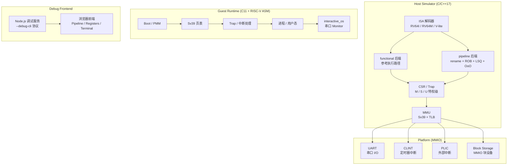

# myCPU 项目展示

> 一套从零设计、独立实现的 RISC-V 系统模拟器，已经可以运行自制的小型操作系统内核。

## 项目定位

myCPU 不是课程作业式的一次性原型，而是一套持续演进的系统模拟器工程：

- 从 C 原型逐步演进到模块化 C++ 架构
- 统一 ISA 语义来源，同时支持参考执行和乱序流水线两种执行模型
- 自带一套从 boot 到用户态的 guest 操作系统内核
- 配套浏览器可视化前端，可交互式观察 CPU 执行全过程

## 核心技术亮点

### ISA 与执行模型

| 能力 | 实现 |
|-----|------|
| 基础指令集 | RV64I（整数）+ RV64M（乘除法） |
| 向量扩展 | V-lite 子集：vsetcfg / vle / vse / vadd / vmul / vmax / vdot |
| 参考后端 | `functional` — 以 ISA 正确性为主的顺序执行 |
| 乱序后端 | `pipeline` — rename + ROB + LSQ + 真实 OoO execute |
| 语义统一 | 两种后端共享同一套 ISA 解码与语义定义 |

### 特权级与虚拟内存

| 能力 | 实现 |
|-----|------|
| 特权模式 | M / S / U 三级，完整 trap delegation |
| 虚拟内存 | Sv39 三级页表 |
| TLB | 最小 TLB + sfence.vma |
| Page Fault | 完整的取指 / load / store page fault 语义 |
| 特权隔离 | S-mode 对 U=1 可执行页、U-mode 对 supervisor-only 页面的正确隔离 |

### 硬件平台

| 设备 | 功能 |
|-----|------|
| UART | 串口输入输出，支持 guest 与 host 终端交互 |
| CLINT | 定时器中断（mtimecmp / mtime） |
| PLIC | 外部中断控制器 |
| Block Storage | MMIO 块设备，支持 guest 发起存储读取 |

### 自制 OS 内核（kernel_alpha）

从零开始的完整 bring-up 路径：

```
Boot → Early Allocator → Bitmap PMM → Sv39 页表建立
    → Trap / 中断处理 → 用户态进程 → 存储读取
```

已验证的 10 条回归基线：
- 1 条正向路径：完整 boot → PMM → Sv39 → interrupt → storage → `KMVPETDS`
- 9 条负向路径：CLINT unmapped、timer not-ready、PLIC not-ready、storage no-media / not-ready / bad-magic / bad-block-count / LBA-range / bad-command

### 交互式 Monitor（interactive_os）

浏览器终端 + guest 串口 monitor 的完整闭环：

```
help · echo · time · uptime · disk info · disk read <lba>
regs · peek <addr> · pagewalk <addr> · pte dump <addr> · halt
```

### 向量扩展与 ML Workload

| 阶段 | 成果 |
|-----|------|
| V0/V1 | V-lite 设计冻结、shared semantics、host 回归 |
| V2 | dot / GEMM / Conv / ReLU workload smoke、guest_vector_demo |
| V3 | 固定 conv→relu guest demo、guest_vector_cnn_demo |
| V4 | non-memory vector ALU 脱离 serializing fallback，最小 vector-aware pipeline |

### 浏览器可视化前端

| 功能 | 说明 |
|-----|------|
| Pipeline 时序图 | Stage cards + Timeline 行，可视化指令在流水线中的流动 |
| 寄存器 / CSR 面板 | 实时显示 x0-x31、CSR 值，高亮变化的寄存器 |
| 交互式终端 | 浏览器内的终端窗口，直接与 guest monitor 交互 |
| 向量寄存器面板 | SEW / VL + v0..v31 完整快照 |
| Workload 导览 | 向量指令高亮、conv→relu 专题卡 |
| 会话控制 | Load / Run / Pause / Reset / Step Cycle / Step Commit |

### 验证体系

| 验证维度 | 规模 |
|---------|------|
| 测试文件总数 | 259 个 |
| Make test 目标 | 39 个 |
| 测试类型 | asm 指令级 / host 单元与集成 / guest 系统级 / pipeline / frontend |
| 外部差分 | Spike final-state oracle（独立离线） |
| Guest 回归基线 | 10 条 kernel_alpha + supervisor_demo + interactive_os |

## 项目规模

| 指标 | 数值 |
|-----|------|
| Host 模拟器 (C/C++) | ~41,000 行 |
| Guest 运行时 (C + ASM) | ~10,000 行 |
| 前端 (JavaScript) | ~6,000 行 |
| 设计与状态文档 | 26 篇 |
| 测试文件 | 259 个 |
| Git 提交 | 156 次 |
| **总代码量** | **~57,000 行** |

## 系统架构



## 与课程项目的区别

| 维度 | 典型课程项目 | myCPU |
|-----|------------|-------|
| 指令集 | RV32I 子集 | RV64I + RV64M + V-lite 向量扩展 |
| 执行模型 | 单一顺序执行 | functional + pipeline (rename / ROB / LSQ / OoO) |
| 特权级 | 无 或仅 M-mode | M / S / U 完整特权路径 |
| 虚拟内存 | 无 | Sv39 三级页表 + TLB + page fault |
| 外设 | 无 或仅 UART | UART + CLINT + PLIC + Block Storage |
| Guest 软件 | bare-metal 测试 | 完整 OS kernel bring-up + 用户态进程 |
| 可视化 | 无 或静态波形 | 浏览器实时交互前端 |
| 测试 | 少量手动验证 | 259 个自动化测试 + Spike 差分 |
| 工程化 | 单文件/单模块 | 模块化 C++ 架构 + 26 篇技术文档 |
| 代码规模 | 数百~数千行 | ~57,000 行 |

## 演示指南

### 路径 1：快速展示（2 分钟）

展示核心能力：加载程序 → 单步执行 → 观察 CPU 内部状态。

1. 打开浏览器前端 `http://127.0.0.1:4173`
2. 测试选择 `hello_world`，后端选择 `pipeline`
3. 点击 **Load**
4. 点击 **Step Cycle** 3-5 次
5. 观察要点：
   - Pipeline stage cards 显示指令在 fetch / decode / execute / commit 各阶段的流动
   - Timeline 时序行逐行增长，展示指令的并行与依赖关系
   - Registers 面板高亮变化的寄存器值
6. 点击 **Run** 让程序运行到结束

### 路径 2：交互式 OS 演示（3 分钟）

展示完整的 guest-host 交互闭环：自制 OS 在模拟器上运行，通过浏览器终端与用户交互。

1. 测试选择 `interactive_os_demo`，后端选择 `pipeline`
2. 点击 **Load**，然后点击 **Run**
3. 等待 Terminal 显示 `>` 提示符
4. 点击 Terminal 区域获取焦点，依次输入：
   - `help` — 查看所有可用命令
   - `time` — 查看系统计时器状态
   - `regs` — 查看当前寄存器值
   - `pagewalk 80200000` — 展示 Sv39 三级页表地址翻译过程
   - `disk info` — 查看块设备信息
5. 观察要点：
   - Terminal 完整显示命令输出，证明 guest OS 内核在正确运行
   - Pipeline / Events 面板在每次交互时更新，展示 CPU 的实时执行状态

### 路径 3：向量 / ML 演示（2 分钟）

展示向量扩展与 ML workload：固定 conv→relu CNN demo 在模拟器上运行。

1. 测试选择 `guest_vector_cnn_demo`，后端选择 `functional`
2. 点击 **Load**，然后点击 **Run**
3. Terminal 输出 `V3OK` 表示 conv→relu 链路计算正确
4. 观察要点：
   - Workload 面板展示 conv→relu 的数据流
   - 向量寄存器面板显示 SEW / VL 配置与 v0..v31 的当前值
   - 向量指令在 Pipeline 中的高亮标识
5. 可切换到 `guest_vector_demo` 运行 dot / GEMM / Conv / ReLU 全套 workload

## 关键文档

| 文档 | 说明 |
|-----|------|
| [AGENTS.md](../AGENTS.md) | 项目总览与开发约定 |
| [docs/index.md](index.md) | 文档统一入口 |
| [mainline_status.md](status/mainline_status.md) | 主线当前状态 |
| [kernel_alpha_status.md](status/kernel_alpha_status.md) | 内核 bring-up 状态 |
| [vector_ml_workload_direction_design.md](design/vector_ml_workload_direction_design.md) | 向量/ML 设计文档 |
| [phase4_preparation_design.md](design/phase4_preparation_design.md) | Phase 4 准备设计 |
