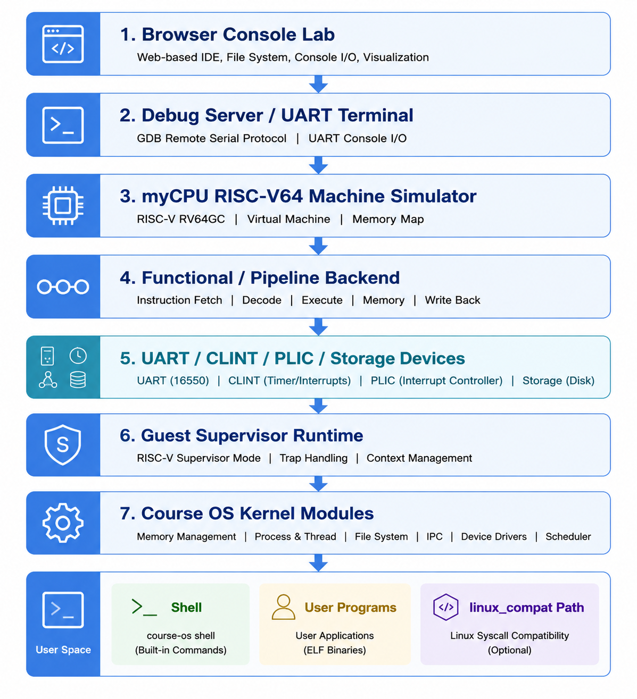
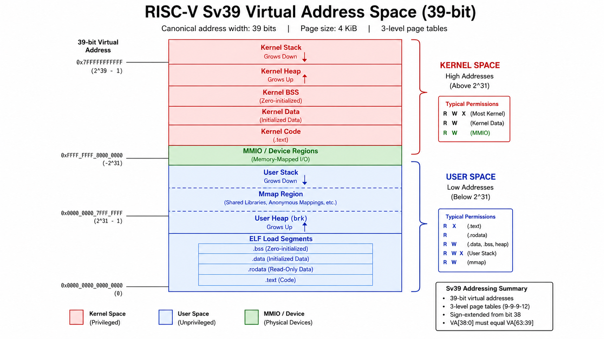
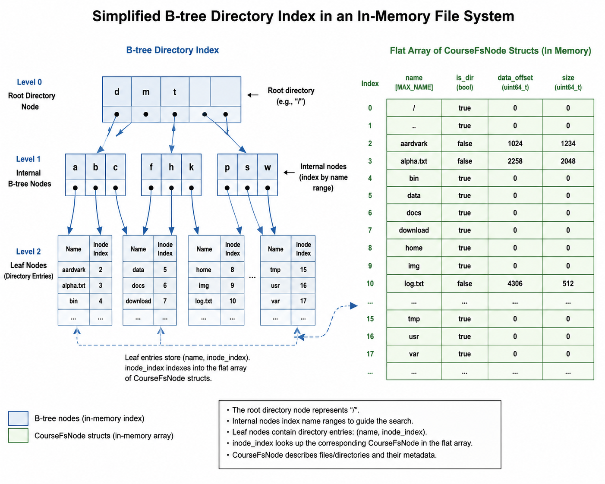
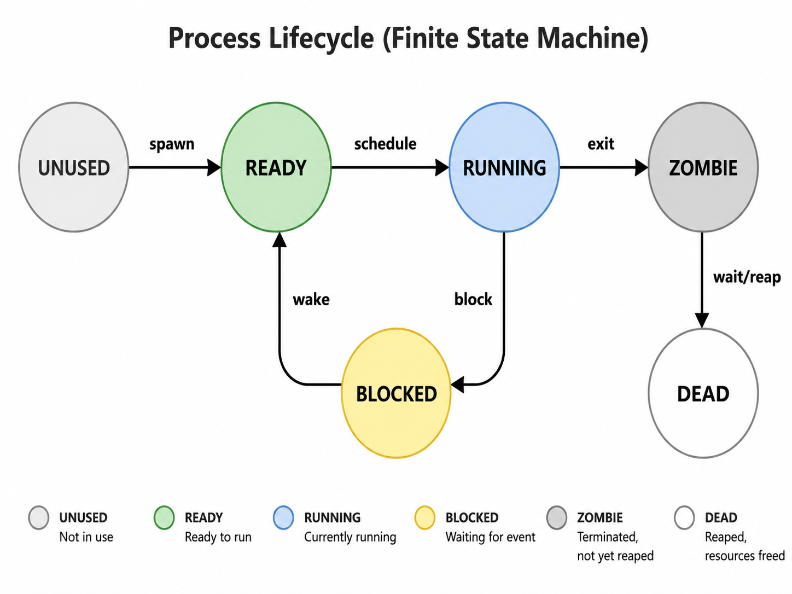
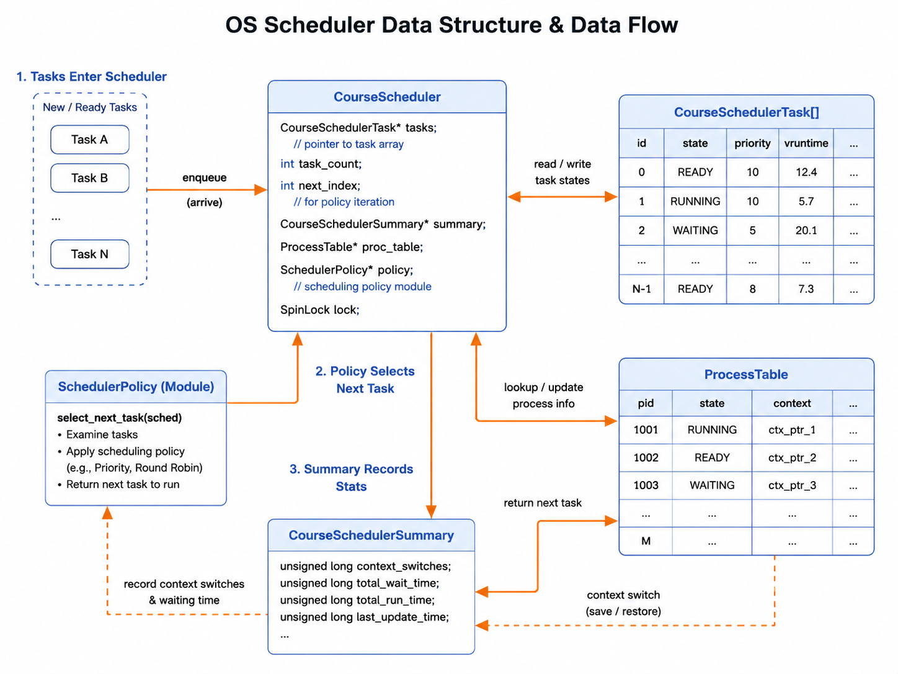
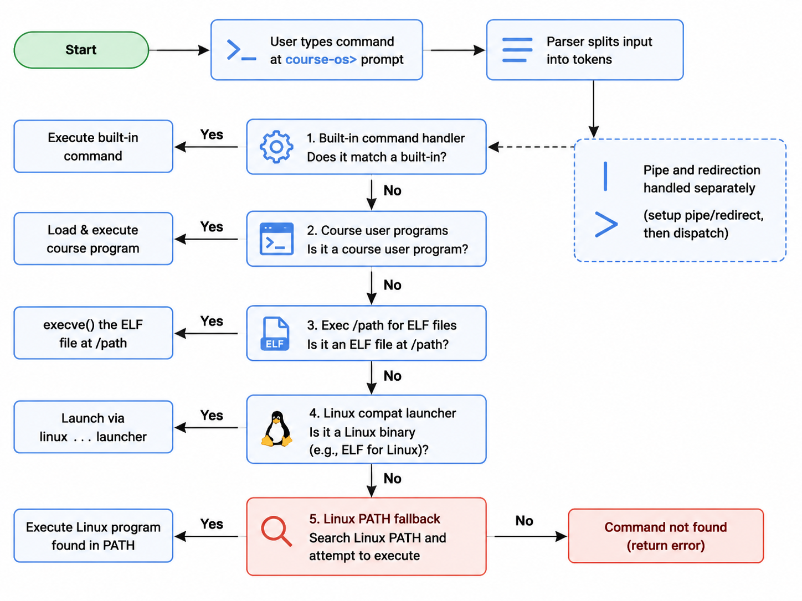
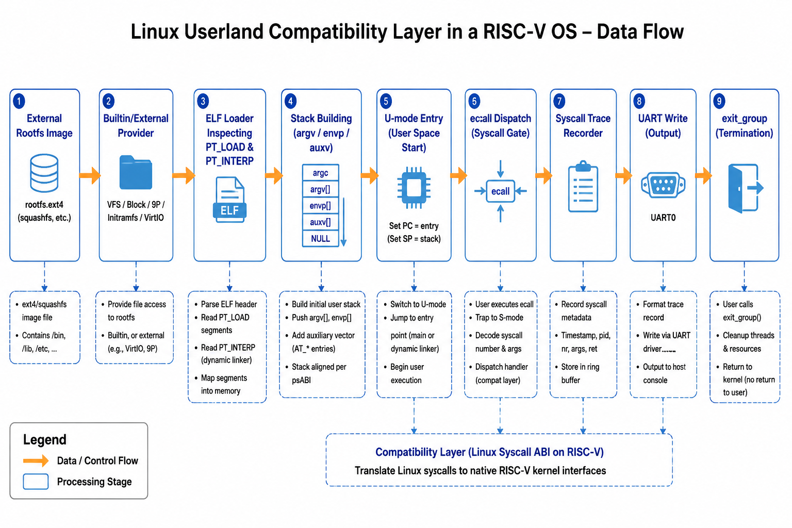

# myCPU Course OS 技术文档

**项目名称：** myCPU Course OS
**运行平台：** myCPU RISC-V64 系统模拟器
**文档日期：** 2026 年 6 月 17 日
**文档性质：** 课程结题 / 答辩技术文档

## 摘要

myCPU Course OS 是在自研 RISC-V64 系统模拟器 myCPU 之上实现的一套教学级操作系统内核。它不是对现有 Linux 或 xv6 的移植，而是在模拟器已经提供的 CPU、CSR、MMU、UART、CLINT、PLIC、Storage 等平台能力和 guest supervisor runtime 基础上，继续构建出的 Course OS 主线。

本文档按操作系统大赛决赛设计文档的组织方式，系统介绍 Course OS 的整体架构、内核基础设施、内存管理、文件系统、进程管理与调度、系统调用、交互 shell、`/proc` 可观察证据面、Linux 用户态兼容扩展、OSComp 外部验证以及验证体系。当前系统已经能够运行课程级内核 smoke、常驻 `course-os> ` 交互 shell、5 个课程用户程序、FD / FS / procfs 操作、COW（Copy-On-Write）fork、用户态崩溃隔离、FCFS / RR / CFS-lite 调度统计、在线抢占调度模型、UART 中断输入路径，并在显式提供外部 rootfs 时运行 BusyBox / git 等受限 Linux 用户态程序。

**关键词：** RISC-V64、操作系统内核、系统模拟器、Course OS、Linux 兼容

---

## 目录

1. [概述](#1-概述)
2. [内核基础设施](#2-内核基础设施)
3. [内存管理](#3-内存管理)
4. [文件系统](#4-文件系统)
5. [进程管理与调度](#5-进程管理与调度)
6. [系统调用、ELF 与用户程序](#6-系统调用elf-与用户程序)
7. [交互 shell 与前端终端](#7-交互-shell-与前端终端)
8. [`/proc` 可观察证据面](#8-proc-可观察证据面)
9. [Linux 用户态兼容 Plus](#9-linux-用户态兼容-plus)
10. [OSComp 外部验证](#10-oscomp-外部验证)
11. [验证体系](#11-验证体系)
12. [遇到的问题和解决方案](#12-遇到的问题和解决方案)
13. [总结与展望](#13-总结与展望)

---

## 1. 概述

### 1.1 项目背景

myCPU 是一个从 C 原型逐步演进到模块化 C++ 架构的小型 RISC-V 模拟器。在模拟器本身已经能够解释 RISC-V64 指令、维护 CSR（Control and Status Register）状态、处理 MMU 地址转换、并提供 UART / CLINT / PLIC / Storage 等最小平台设备之后，下一步自然需要一个可以在其上实际运行的操作系统内核，来验证模拟器的可用性，并作为操作系统课程的教学载体。

Course OS 的定位正是这个教学级内核。它的目标不是追赶通用 Linux 发行版，而是在 myCPU 提供的有限但清晰的硬件契约上，自底向上实现进程管理、内存管理、文件系统、系统调用、用户程序和交互 shell 等操作系统核心模块，同时保证每一条路径都可观察、可回归、可答辩演示。

与直接移植 xv6 或 Linux 不同，Course OS 选择复用 myCPU guest supervisor runtime 已经沉淀的 bring-up、PMM、Sv39、trap、user runtime 等基础设施，再在其上叠加课程 OS 模块。这样既避免重复造轮子，又能让学生把注意力集中在操作系统课程本身要回答的问题上：进程如何创建和调度、虚拟内存如何按需分配、文件系统如何组织、系统调用如何分发、用户程序如何加载和执行。

### 1.2 整体架构

Course OS 建在 myCPU 模拟器提供的 RISC-V64 平台之上。模拟器负责指令执行、CSR、MMU、外设 MMIO 和 debug session；guest 侧内核负责进程、内存、文件系统、系统调用和用户交互。



上图展示了从浏览器前端到内核模块的完整分层：

- **Browser / Console Lab**：前端 `/console` 页面，通过 debug server 与模拟器交互。
- **debug server / UART terminal**：本地调试服务把终端输入输出转换为 UART 字节流。
- **myCPU Machine**：模拟器核心，包含 functional backend 和 pipeline backend 两种执行形态。
- **guest supervisor runtime**：S-mode 最小运行环境，包括 PMM、Sv39、trap、timer、PLIC、UART、storage。
- **Course OS kernel modules**：课程 OS 模块，包括 scheduler、memory、FS、FD、process、syscall、shell、ELF / libc、sync、procfs。
- **course-os shell / user programs / linux_compat**：常驻交互 shell、课程用户程序以及 Linux 用户态兼容旁路。

核心设计思路是"课程 OS 模块"与"Linux compat 模块"分流。课程能力使用 `course_*` 模块，保持教学级 ABI 和合同；Linux 用户态兼容使用 `linux_compat_*` 模块，通过显式 `linux ...` launcher 或受控 PATH fallback 进入旁路，避免把课程模块直接膨胀成通用 Linux 兼容层。

### 1.3 代码结构总览

Course OS 相关实现主要集中在 `myCPU/guest` 目录下，按"基础设施层 → 课程 OS 模块层 → 编排层 → 独立入口"四层组织：

```text
myCPU/guest
├── kernel
│   ├── pmm.c                    # 物理页管理
│   ├── vm*.c                    # Sv39 页表、地址空间、VM process / object / fault
│   ├── trap*.c                  # trap context、dispatch、user runtime
│   ├── console.c / timer.c      # UART、timer 平台封装
│   ├── storage.c                # SimpleStorage 平台封装
│   ├── kernel_bringup.c         # 通用 K/M/V bring-up 骨架
│   ├── kernel_runtime.c         # 最小 kernel runtime 对象
│   ├── supervisor_runtime.c     # supervisor bring-up 共享状态
│   ├── course_scheduler.c       # FCFS / RR / CFS-lite 调度与统计
│   ├── course_memory.c          # Demand Paging / Clock / kmalloc
│   ├── course_fs.c              # 课程 RAMFS、B 树目录索引
│   ├── course_fd.c              # FD 表、统一 I/O
│   ├── course_process.c         # 进程生命周期、COW fork
│   ├── course_syscall.c         # 课程 syscall 分发
│   ├── course_elf_loader.c      # 教学级 ELF loader
│   ├── course_libc.c            # 简化 libc syscall wrapper
│   ├── course_sync.c            # semaphore / mutex 教学模型
│   ├── course_shell.c           # shell parser、builtin、命令分发
│   ├── course_shell_linux.c     # Linux launcher / PATH fallback
│   ├── procfs.c                 # 只读 /proc 证据面
│   ├── course_os_stage1.c       # Stage 1 smoke 编排
│   ├── course_os_stage2.c       # Stage 2 smoke 编排
│   ├── course_os_stage3.c       # Stage 3 smoke 编排
│   └── linux_compat*.c          # Linux ABI / rootfs / loader / VM / process 旁路
├── include                      # 对应头文件
├── kernel_alpha                 # 一次性 Stage 1/2/3 smoke 入口与负向 demo
├── course_os_shell              # 常驻 `course-os> ` shell 入口
└── interactive_os               # 串口 monitor 入口（与 Course OS 共享 runtime）
```

这种分层让 `kernel_alpha/main.c` 和 `course_os_shell/main.c` 只做入口编排，不再承载大块业务逻辑。每个子模块都有独立的头文件、实现和单元测试，方便单独验证。

---

## 2. 内核基础设施

### 2.1 RISC-V64 模拟器平台

myCPU 模拟器为 Course OS 提供了 RISC-V64 平台的最小可用集合：

- **CPU / CSR**：Course OS 主要依赖 RV64 supervisor / user、CSR、Sv39、trap 与基础整数 / 原子相关路径；模拟器也按其他 workload 需求补充 compressed、浮点子集和 V-lite 等能力。supervisor 模式所需 CSR 包括 `sstatus`、`sepc`、`scause`、`stval`、`satp`、`sie`、`sip` 等。
- **MMU / Sv39**：模拟器维护三级页表，支持读 / 写 / 执行 / 用户位权限检查，能够触发 page fault、instruction fault、store fault 等异常。
- **UART**：16550 风格串口，用于内核早期输出和 shell 输入输出。
- **CLINT**：提供 timer 中断源。
- **PLIC**：提供外部中断汇聚，当前主要连接 UART RX 中断。
- **SimpleStorage**：单块、同步、无 completion interrupt 的最小存储设备，用于课程文件系统的 backing。

选择 RISC-V64 而不是更复杂的 x86 或 ARM，是因为 RISC-V 的特权架构相对简洁，CSR 和页表规则对教学更友好；同时 RISC-V 开源生态成熟，学生可以参考大量公开资料。

### 2.2 最小 kernel bring-up

Course OS 复用了 guest supervisor runtime 的 bring-up 路径。系统从 M-mode 进入 S-mode 后，依次完成以下最小证据链，标记为 `K/M/V/P/E/T`：

- `K`：进入独立 kernel 入口，代码不再运行在 bootloader 提供的临时环境中。
- `M`：memory / PMM 初始化完成，物理页帧可以通过 bitmap 分配和释放。
- `V`：自建 Sv39 内核页表启用并稳定工作，内核能够访问高地址映射。
- `P`：PLIC 最小 supervisor 初始化完成，外部中断路径打通。
- `E`：第一次 supervisor external interrupt 到达，证明 PLIC → CPU 中断投递正常。
- `T`：第一次 timer interrupt 到达，证明 CLINT timer + supervisor timer interrupt 路径正常。

完成这六步后，Course OS 才进入 Stage 1/2/3 smoke 或常驻 shell。这条证据链保证了后续功能建立在可靠的基础设施之上。

### 2.3 负向保护性回归

除了正向 bring-up，Course OS 还保留了一组负向 demo，用于证明失败路径不会被正向 smoke 掩盖：

| demo 名称 | 验证点 | marker 输出 |
|---|---|---|
| `kernel_alpha_fault_demo` | VM 开启后非法 MMIO / fault 路径 | `KMVX` |
| `kernel_alpha_plic_not_ready_demo` | PLIC 未就绪失败路径 | `KMVPX` |
| `kernel_alpha_timer_not_ready_demo` | timer 未就绪失败路径 | `KMVPETX` |
| `kernel_alpha_storage_no_media_demo` | storage 无介质 | `KMVNX` |
| `kernel_alpha_storage_not_ready_demo` | storage 未 ready | `KMVRX` |
| `kernel_alpha_storage_bad_magic_demo` | storage magic 错误 | `KMVGX` |
| `kernel_alpha_storage_bad_block_count_demo` | block count 错误 | `KMVBX` |
| `kernel_alpha_storage_lba_range_demo` | LBA 越界 | `KMVLX` |
| `kernel_alpha_storage_bad_command_demo` | storage command 错误 | `KMVCX` |

这些负向验证让 Course OS 在扩展新功能时，仍能及时发现对基础设施合同的破坏。

---

## 3. 内存管理

### 3.1 物理内存管理

Course OS 的物理内存管理由 guest runtime 的 bitmap PMM 提供。系统在 bring-up 阶段从 linker symbol 获取可用物理内存范围，然后按页（4 KB）建立 bitmap。每个物理页用一位表示"已分配 / 空闲"，分配时扫描找到第一个空闲页，释放时清对应位。

这种实现虽然简单，但足以支撑教学级内核的需求：

- 页帧分配和释放的时间复杂度都是 O(n)，n 为总页数，对于课程演示规模完全可接受。
- 没有外部碎片问题，因为所有分配都是单页。
- 便于观察和调试：可以直接打印 bitmap 的占用情况。

```c
void pmm_init(void);
void* pmm_alloc_page(void);
bool pmm_free_page(void* page);

uintptr_t pmm_managed_start(void);
uintptr_t pmm_managed_end(void);
size_t pmm_total_pages(void);
size_t pmm_free_pages(void);
size_t pmm_used_pages(void);
```

课程 OS 模块本身不直接操作 PMM，而是通过 `vm_address_space_t` / `vm_process_t` 等高层抽象申请和释放物理页。

### 3.2 Sv39 地址空间

Course OS 采用 RISC-V Sv39 三级页表方案。虚拟地址宽度为 39 位，每级页表索引 9 位，页内偏移 12 位，物理页大小 4 KB。



内核地址空间在 bring-up 阶段建立，包含：

- 内核代码段、数据段、BSS 段的高地址映射。
- UART、CLINT、PLIC、Storage 等外设 MMIO 区域。
- 早期堆和内核栈区域。

用户地址空间则在创建进程时建立，包含：

- ELF 可加载段映射。
- 用户堆（向高地址增长）。
- 用户栈（从高地址向低地址增长）。
- 按需分配的匿名页区域。

guest runtime 提供了三层抽象来管理地址空间：

- `vm_address_space_t`：表示一个完整地址空间，持有根页表。
- `vm_process_t`：表示一个进程视角的 VM，绑定到 address space。
- `vm_object_t` / `vm_user_region_t`：表示地址空间中的一段连续区域及其 fault policy。

这种分层让缺页处理可以按 region 类型采取不同策略：匿名页按需分配、COW 页触发复制、文件映射从 backing 读取等。

### 3.3 Demand Paging 与 Clock 页面置换

课程内存模块实现了可观察的 Demand Paging（按需分页）和 Clock 页面置换算法。

Demand Paging 的核心思想是：进程创建时不预先分配所有物理页，而是在访问未映射地址时触发 page fault，再由内核按需求分配。这样可以显著减少启动时的内存占用，也让学生直观看到"虚拟地址到物理地址的延迟绑定"。

```c
typedef struct CourseMemoryFrame {
    bool resident;      // 是否已分配物理页
    uint32_t page_id;   // 虚拟页编号
    bool referenced;    // Clock 访问位
    bool dirty;         // 是否被写入
} course_memory_frame_t;

typedef struct CourseMemory {
    course_memory_frame_t frames[COURSE_MEMORY_MAX_FRAMES];
    uint32_t frame_count;
    uint32_t clock_hand;
    course_memory_stats_t stats;
} course_memory_t;
```

当 page fault 发生时，内核首先检查是否还有空闲 frame。如果有，直接分配；如果没有，则触发 Clock 页面置换：

1. 从 clock hand 所指位置开始扫描。
2. 如果 `referenced == true`，将其清为 false，继续扫描。
3. 如果 `referenced == false`，选择该页作为牺牲页，写回（如果需要）后重新分配给新页。
4. 移动 clock hand。

课程模块把 `page_faults`（缺页次数）和 `page_reclaims`（回收次数）记录到 `course_memory_stats_t`，并通过 `/proc/meminfo` 暴露，形成可直接观察的证据。

### 3.4 COW Fork

COW（Copy-On-Write，写时复制）fork 是 Course OS 内存管理的另一个教学重点。它的目标是：fork 创建子进程时，父子进程先共享同一份物理页并标记为只读；直到某一方尝试写入时，才复制出独立副本。

实现流程如下：

1. `course_process_fork()` 复制父进程的进程控制块和页表映射，但把共享用户页的 PTE 可写位清除，并标记 COW。
2. 父子进程任一方向共享页写入时，MMU 触发 store page fault。
3. `course_process_handle_cow_store_fault()` 检查引用计数：
   - 如果引用计数为 1，说明只有当前进程使用该页，直接恢复可写位即可。
   - 如果引用计数大于 1，分配新物理页，复制旧页内容，更新当前进程页表指向新页，再恢复可写位。

```c
typedef struct CourseProcessCowPage {
    bool used;
    uint32_t id;
    uint32_t refcount;
    uint8_t data[COURSE_PROCESS_USER_PAGE_SIZE];
} course_process_cow_page_t;
```

课程模块维护以下统计：

- `cow_faults`：触发的 COW 写保护异常次数。
- `copied_pages`：实际复制的页数。
- `saved_pages`：通过共享避免的页复制次数。
- `refcount_peak`：引用计数峰值。

`/proc/cow` 节点会输出这些字段，让学生在 fork / write 后能直接看到 COW 的收益。


---

## 4. 文件系统

### 4.1 课程 RAMFS 设计

Course OS 的文件系统是内存中的教学级文件系统，目标是清晰展示路径解析、目录树、文件读写、seek 和目录索引，而不是实现真实磁盘的 journaling 或 crash recovery。

课程 FS 的核心指标在 `course_fs_stats_t` 中体现：

- 课程验收指标为至少 128 个文件；底层节点槽位 `COURSE_FS_MAX_NODES` 当前为 160。
- 单文件最大 64 KB（`COURSE_FS_MAX_DATA`）。
- 目录树至少支持 3 层深度。

```c
typedef struct CourseFsNode {
    bool used;
    bool is_dir;
    int parent;
    char name[COURSE_FS_MAX_NAME];
    size_t data_offset;
    size_t data_capacity;
    size_t size;
    int dir_index[COURSE_FS_MAX_DIR_INDEX_ENTRIES];
    size_t dir_index_count;
    size_t btree_leaf_starts[COURSE_FS_MAX_LEAVES];
    size_t btree_leaf_counts[COURSE_FS_MAX_LEAVES];
    size_t btree_leaf_count;
    size_t btree_internal_count;
} course_fs_node_t;
```

每个文件或目录对应一个 `course_fs_node_t`。目录节点用 `dir_index` 保存直接子节点的索引数组；文件节点用 `data_offset` 和 `size` 指向实际数据。

课程 FS 支持以下操作：

- `course_fs_mkdir()` / `course_fs_rmdir()`：目录创建和删除。
- `course_fs_create()` / `course_fs_unlink()`：文件创建和删除。
- `course_fs_read()` / `course_fs_write()`：文件读写。
- `course_fs_seek()`：文件指针定位。
- `course_fs_mkfs()`：重置文件系统。
- `course_fs_listdir()`：目录枚举。

### 4.2 简化 B 树目录索引

为了让目录查找过程可观察，Course FS 在目录节点中维护了一个简化 B 树索引。与线性扫描相比，B 树索引可以让学生在 `/proc/fsstat` 中看到 `btree_compare_steps`、`btree_internal_nodes`、`btree_leaf_nodes` 等统计，直观理解目录索引的成本。



简化 B 树的每个叶节点最多保存 4 个目录项（`COURSE_FS_BTREE_LEAF_CAPACITY`）。查找时从内部节点开始比较，逐步定位到叶节点，再比较叶节点内的条目。由于课程规模较小，这棵 B 树不会很深，但足以展示索引结构的基本思想。

### 4.3 FD 表与统一 I/O

FD（File Descriptor）层把普通文件、标准输入输出和 procfs 节点统一到一个进程级 I/O 接口。每个进程拥有一张 FD 表，记录当前打开的文件对象。

```c
typedef enum CourseFdKind {
    COURSE_FD_KIND_UNUSED = 0,
    COURSE_FD_KIND_STDIO,
    COURSE_FD_KIND_FILE,
    COURSE_FD_KIND_PROC,
} course_fd_kind_t;

typedef struct CourseFdEntry {
    course_fd_kind_t kind;
    uint32_t flags;
    size_t offset;
    char path[COURSE_FD_MAX_PATH];
} course_fd_entry_t;

typedef struct CourseFdTable {
    course_fs_t* fs;
    procfs_t* procfs;
    char cwd[COURSE_FD_MAX_PATH];
    course_fd_entry_t entries[COURSE_FD_MAX_OPEN];
} course_fd_table_t;
```

FD 层提供统一的 `open` / `close` / `read` / `write` / `seek` 接口：

- `0/1/2` 固定对应 stdin / stdout / stderr。
- 普通文件通过课程 FS 节点读写。
- procfs 只读节点通过 FD 读取。
- cwd 和相对路径解析由 FD 表统一维护。

一个值得注意的合同修正发生在 `course_fd_read()`：早期实现会在读取 `size` 字节后额外写 `out[size] = '\0'`，如果调用方只提供精确大小 buffer 会导致越界。当前版本已改为 raw read 合同，只写实际读取字节数，并由 canary 单测固定该边界。

### 4.4 管道与重定向

shell 和 syscall 层支持单级 pipe 和基础重定向。当前课程 pipe 是 shell 级数据流编排，不是独立的 `COURSE_FD_KIND_PIPE` 对象。

单级 pipe 的实现流程：

1. shell 解析 `cmd1 | cmd2`，把命令拆成两个 pipeline stage。
2. 左侧命令的输出写入 shell 管道缓冲。
3. 右侧命令从管道缓冲读取输入。
4. 两个命令依次执行，数据通过 shell 内存缓冲传递。

```sh
course-os> echo hello | cat
```

输出重定向支持 `>` 把命令输出写入课程 FS 文件；输入重定向支持 `<` 从文件读取。该实现服务课程 shell，不声明完整 POSIX shell 的 job control、here document 或复杂 pipeline。

---

## 5. 进程管理与调度

### 5.1 进程生命周期

Course OS 实现了课程级进程表和状态机。每个进程对应一个 `course_process_t` 结构：

```c
typedef struct CourseProcess {
    bool used;
    uint32_t pid;
    uint32_t ppid;
    course_process_state_t state;
    course_process_abi_t abi;
    int32_t exit_code;
    char crash_reason[COURSE_PROCESS_MAX_NAME];
    uintptr_t crash_sepc;
    uint64_t crash_scause;
    uintptr_t crash_stval;
    void* address_space;
    void* open_files;
    char name[COURSE_PROCESS_MAX_NAME];
    char argv[COURSE_PROCESS_MAX_ARGV];
    uintptr_t entry_pc;
    uintptr_t user_sp;
    size_t map_count;
    course_elf_map_t maps[COURSE_PROCESS_MAX_MAPS];
    course_process_user_page_ref_t user_pages[COURSE_PROCESS_MAX_USER_PAGES];
} course_process_t;
```

进程状态包括：

- `UNUSED`：未使用槽位。
- `READY`：就绪，等待调度。
- `RUNNING`：正在运行。
- `BLOCKED`：阻塞，例如等待子进程退出。
- `ZOMBIE`：已退出但尚未被父进程回收。
- `DEAD`：已回收，槽位可复用。



Course OS 实现了完整的进程生命周期接口：

- `course_process_spawn()`：创建新进程。
- `course_process_fork()`：COW fork。
- `course_process_exec_image()`：加载 ELF 并替换进程映像。
- `course_process_exit()`：进程退出，进入 zombie 状态。
- `course_process_wait()` / `course_process_waitpid()`：父进程回收子进程。
- `course_process_kill()`：发送终止信号并切换状态。

一个关键设计是 crash isolation：用户程序发生非法访问、非法指令等异常时，内核不会 panic，而是把该异常收敛为进程级退出，并记录 `crash_reason`、`crash_sepc`、`scause`、`stval` 到 `/proc/crashlog`。这让学生看到"内核稳定，用户进程崩溃被隔离"。

### 5.2 课程调度器

调度器分为离线统计模型和在线抢占模型。

离线模型 `course_scheduler_run()` 用于稳定验证三种调度策略：

```c
typedef enum CourseSchedPolicy {
    COURSE_SCHED_POLICY_FCFS = 0,
    COURSE_SCHED_POLICY_RR,
    COURSE_SCHED_POLICY_CFS_LITE,
} course_sched_policy_t;
```

- **FCFS（First-Come-First-Served）**：按到达顺序执行，非抢占。
- **RR（Round Robin）**：按时间片轮转，时间片到则切换。
- **CFS-lite**：按虚拟运行时间 vruntime 选择下一个任务，近似 Linux CFS 的教学简化版。

离线模型输出每个任务的等待时间、周转时间、完成时间，以及总 context switch 次数、preempt 次数、平均等待时间、平均周转时间。`/proc/schedstat` 会暴露这些统计字段。



### 5.3 在线抢占调度

在线模型 `course_online_scheduler_t` 是后续补上的抢占式调度路径，以 timer tick 为唯一推进单位：

```c
typedef struct CourseOnlineScheduler {
    course_process_table_t* process_table;
    course_online_scheduler_task_t tasks[COURSE_SCHEDULER_MAX_TASKS];
    size_t task_count;
    size_t current_index;
    uint32_t slice_used;
    course_online_scheduler_summary_t summary;
} course_online_scheduler_t;
```

它复用课程进程状态，按 READY / RUNNING / BLOCKED / ZOMBIE / DEAD 选择可运行进程：

- RR 支持 time slice 到期抢占。
- FCFS 不因 tick 抢占当前进程。
- CFS-lite 按 online `vruntime` 选择运行更少的任务。

timer 接入通过 supervisor timer post handler 显式开启。未安装时，默认 `kernel_alpha_demo`、Stage marker 和 shell prompt 行为完全不变，这保证了在线调度不会破坏已有回归。

### 5.4 Context switch cost 证据

当前 context switch cost 是 scheduler-local cycle 证据，不声明真实硬件或 QEMU wall-clock 延迟。`course_scheduler_summary_t` 记录：

- `last_switch_cycle_cost`：最近一次切换消耗的 cycle 数。
- `total_switch_cycle_cost`：累计切换 cycle 数。

`/proc/schedstat` 输出对应字段，但不输出 ns / us / ms 等时间换算。这样既能回答"是否有调度代价证据"，又避免把模拟模型误写成真实硬件 latency。

---

## 6. 系统调用、ELF 与用户程序

### 6.1 课程 syscall ABI

Course OS 实现了课程 syscall 分发层，覆盖课程范围内的常用接口：

| 类别 | syscall |
|---|---|
| 文件 I/O | `read`、`write`、`open`、`close`、`seek` |
| 进程控制 | `exit`、`fork`、`exec`、`wait` / `waitpid`、`getpid`、`ps`、`kill` |
| 文件系统 | `mkdir`、`rmdir`、`unlink`、`mkfs`、`chdir`、`getcwd` |
| 信息查询 | `getpid`、`ps` |

syscall 从 U-mode 通过 `ecall` 进入 S-mode，trap dispatch 根据 a7 寄存器中的 syscall 号分发到 `course_syscall_dispatch()`。错误处理遵循"不伪造成功"原则：坏用户指针、坏 fd、坏路径、非法 syscall、权限错误都会返回负错误码，而不是静默成功。

### 6.2 教学级 ELF Loader

课程 ELF loader 支持仓库内手写的最小 RV64 little-endian `ET_EXEC`：

1. 校验 ELF magic、字长、字节序、类型。
2. 读取 program header，找到 `PT_LOAD` segment。
3. 按 segment 的虚拟地址和权限建立映射。
4. 校验 entry 是否落在 executable segment。
5. 更新进程 image、entry、argv、stack 和 maps。

```c
typedef struct CourseElfMap {
    char name[COURSE_ELF_MAP_NAME_MAX];
    uintptr_t start;
    uintptr_t end;
    uint32_t flags;
    bool cow;
} course_elf_map_t;
```

当前 5 个课程用户程序使用不同的最小 ELF bytes，不再共享一段占位 ELF。loader 能观察不同 entry、code segment 和 data segment，证明 ELF 装载路径是通用的。

### 6.3 libc 与用户程序

系统提供简化 libc syscall wrapper 和课程用户程序 catalog。已接入的课程用户程序包括：

- `hello`：打印问候信息，验证基本 syscall。
- `echo`：回显参数，验证参数传递。
- `cat`：读取文件内容，验证 FD / FS。
- `forktest`：测试 fork / wait，验证 COW。
- `crashdemo`：触发非法访问，验证 crash isolation。

这些程序用于证明用户程序、syscall、FD / FS、fork、COW 和 crash isolation 的端到端路径。

### 6.4 `exec /path` 外部课程 ELF

`course-os> exec /path/to/prog [arg]` 可以从课程 FS 中读取受控 ELF 文件，并复用 `course_process_exec_image()`、`course_elf_loader` 和课程 process image 更新路径。

失败语义固定为：

- 缺文件或目录：`exec: no such file`。
- 非 ELF 或坏 entry：`exec: bad elf`。
- 失败命令会阻断 `&&` 右侧命令。

该能力不执行 host 任意路径，不读取外部 rootfs，不依赖本机交叉编译器，也不进入 Linux compat 路径。

---

## 7. 交互 shell 与前端终端

### 7.1 `course-os> ` shell

`guest_course_os_shell_demo` 启动后进入常驻 `course-os> ` prompt。shell 支持以下命令：

- 内置命令：`help`、`ls`、`cat`、`echo`、`ps`、`kill`、`cd`、`pwd`、`exit`、`mkfs`。
- 同步展示：`sem`、`mutex`、`concurrency_demo`。
- 程序加载：`exec /path`、5 个内置课程用户程序。
- 脚本模式：`sh /demo.sh`。
- 管道与重定向：`cmd1 | cmd2`、`>`、`<`。
- 成功链：`cmd1 && cmd2`。
- Linux 启动器：显式 `linux ...`、Linux PATH fallback。
- proc 快捷命令：`meminfo`、`schedstat`、`fsstat`、`syscalls`、`cow`、`crashlog`、`cpuinfo`、`uptime`、`status [pid]`、`fd [pid]`、`maps [pid]`。



`&&` 当前使用 structured command status，不再扫描输出字符串判断成败。因此普通命令输出里出现 `linux-compat:` 这类文本不会误阻断右侧命令。

### 7.2 同步机制展示

课程同步模块实现了 semaphore / mutex 教学模型：

- `sem` 展示 semaphore value 和 waiters。
- `mutex` 展示 owner、waiters 和 misuse guard。
- `concurrency_demo` 展示同步机制组合。

这些命令用于展示同步状态和阻塞 / 唤醒概念，不声明完整 pthread、futex 或真实多核同步。

### 7.3 UART 中断输入

shell 输入路径已经接入 UART RX 中断：

1. shell 入口显式开启 supervisor external policy。
2. 配置 PLIC supervisor context。
3. 设置 `UART_IER_RDI`，打开 RX data available interrupt。
4. UART RX external post handler 将字节 drain 到 `console_input_state_t` raw FIFO。
5. `console_input_poll()` 统一处理回显、退格、不可见字符过滤、溢出和行完成。
6. FIFO 为空时保留轮询 fallback。

连续执行 Linux compat 命令后，shell 的 external post hook 仍保留，prompt 能继续接收输入。该实现不引入完整 TTY、signal、job control 或 termios。

### 7.4 浏览器 `/console` 集成

前端 `/console` 通过已有 debug session 和 UART terminal 合同加载 Course OS shell：

- manifest 标识 `guest_course_os_shell_demo`。
- terminal title、prompt、boot marker 和 command budget 可由 manifest metadata 描述。
- terminal 输入仍是 UART 字节注入，不新增特殊 Course OS API。
- Scenario inspector 展示 host-only external workflow 清单，但不新增浏览器 external rootfs 运行入口。


---

## 8. `/proc` 可观察证据面

### 8.1 设计思想

Course OS 的 `/proc` 是只读证据面，不是控制面。它用于让答辩和回归能直接看到内核状态。所有 `/proc` 节点都在需要时根据当前内核数据结构动态生成文本，而不是持久化在磁盘上。

### 8.2 proc 节点一览


当前节点包括：

| 节点 | 内容 |
|---|---|
| `/proc/ps` | 进程列表 |
| `/proc/meminfo` | 物理页、缺页、回收、分配统计 |
| `/proc/schedstat` | 调度策略、等待 / 周转、context switch、preempt、cycle cost |
| `/proc/fsstat` | 文件系统操作、目录索引、B 树统计 |
| `/proc/syscalls` | syscall 计数和错误摘要 |
| `/proc/cow` | COW fault / copy / saved pages 证据 |
| `/proc/crashlog` | 用户态崩溃隔离记录 |
| `/proc/cpuinfo` | 架构和 `timer_hz=100` 证据 |
| `/proc/uptime` | tick / uptime 证据 |
| `/proc/<pid>/status` | 单进程状态 |
| `/proc/<pid>/fd` | 单进程 FD 表 |
| `/proc/<pid>/maps` | 单进程映射摘要 |

### 8.3 shell 快捷命令

shell 提供了对应快捷命令，例如 `meminfo`、`schedstat`、`fsstat`、`syscalls`、`cow`、`crashlog`、`cpuinfo`、`uptime`、`status [pid]`、`fd [pid]` 和 `maps [pid]`。

`/proc/<pid>/fd` 新增 fd table resolver 合同，旧的 `procfs_attach_fd_table()` 继续作为单表 fallback；Stage 3 procfs 单测固定 pid 1 和 pid 2 分别解析到不同 fd table，防止 per-pid FD 证据面串表。

---

## 9. Linux 用户态兼容 Plus

### 9.1 设计动机

Course OS 的课程模块不直接扩展成 Linux ABI。为了尝试运行 OSComp / testsuits-for-oskernel 涉及的 Linux 用户态程序，系统新增了旁路 `linux_compat_*` 模块。

Shell 路由顺序固定为：

1. 课程 shell 内置命令和 proc 快捷命令。
2. 课程用户程序 catalog。
3. 显式 `linux <path-or-command> [args...]`。
4. Linux rootfs PATH fallback。

这样可以保证 `ls`、`cat`、`ps` 等课程命令不会被 Linux rootfs 中同名程序覆盖。

### 9.2 ABI 与 rootfs 分流

进程 ABI 至少区分：

```text
COURSE_ABI        -> course_syscall_dispatch()
LINUX_COMPAT_ABI -> linux_compat_syscall_dispatch()
```

Linux compat rootfs provider 分为：

- **builtin provider**：默认回归使用，不依赖宿主机镜像，包含最小 busybox / git help 路径。
- **external provider**：显式开启后，从目录或 ext4 rootfs 提取真实工具、interpreter 和 shared assets。

provider 支持 path lookup、metadata、stat、getdents64、read / lseek / close 等基础只读语义。

### 9.3 Loader、syscall 与 real-exec

Linux compat 已实现：

- RV64 `ET_EXEC` / `ET_DYN` ELF inspection。
- `PT_LOAD` load plan。
- `PT_INTERP` interpreter 诊断。
- argv / envp / auxv 用户栈。
- 静态 ELF real-exec。
- U-mode 入口。
- 真实 ecall 分发。
- UART `write`。
- `exit_group`。
- syscall trace record。
- unsupported syscall 返回固定错误码。



常见回归包括：

```sh
course-os> linux /bin/busybox --help
course-os> linux /bin/busybox echo hello
course-os> linux /usr/bin/git -h
course-os> git -h
course-os> git help
```

builtin provider 缺少 `vim` / `gcc` / `rustc` 时输出返回明确错误的诊断，包括 resolved path、`errno=2` 和 `path: no such file`。

### 9.4 Writable workflow

在显式开启 external rootfs 后，Linux compat 已经打通本地有状态 workflow v0：

- session-local writable overlay。
- cwd / relative path。
- `openat(O_CREAT|O_TRUNC|O_WRONLY)`。
- `write` / `pwrite64`。
- `ftruncate`。
- `fsync` / `fdatasync` / `sync` no-op success。
- `mkdirat`、`unlinkat`、`renameat` / `renameat2`。
- `newfstatat` / `fstat` / `statx`、目录枚举。
- pseudo path：`/dev/null`、`/dev/random`、`/proc/self/exe` 和 overlay-created `/tmp`。

可展示 workflow 包括：

```sh
course-os> git init stage11repo
course-os> vim stage11repo/hello.c
course-os> git add stage11repo/hello.c
course-os> git commit -m init
course-os> git log
course-os> cd stage11repo && gcc hello.c && ./a.out
```

最终 `./a.out` 从 session-local overlay 解析，经 Linux compat loader real-exec 输出 `stage11 hello` 并回到 `course-os> ` prompt。这里的 `gcc` 仍是 v0 workflow shim：真实 `/usr/bin/gcc` driver 返回成功后，Linux compat 按默认 `a.out` 或 `-o` 在 overlay 中生成教学级 RV64 ELF artifact。它证明 cwd、overlay、loader 和 prompt 回归，不等价于完整 `cc1/as/ld` 子进程链。

---

## 10. OSComp 外部验证

OSComp / `testsuits-for-oskernel` 被接入为 Linux compat Plus 的可选外部验证证据，而不是默认回归或课程基线完成条件。

显式 host-only target：

```sh
cd myCPU && MYCPU_COURSE_OS_LINUX_COMPAT_ROOTFS=/path/to/rootfs \
  make test-host-course_os_oscomp_basic_smoke
```

缺 `MYCPU_COURSE_OS_LINUX_COMPAT_ROOTFS` 时：

- target 打印 `SKIP`。
- 输出所需环境变量和可选变量。
- 不生成 external provider。
- 不构建 guest generated ELF。
- 退出 0，默认 `make test` 不受影响。

有 rootfs 时，basic smoke 会提取 required assets（`/bin/busybox`、`/usr/bin/git`），并输出 resolved host rootfs path、optional testsuits path、guest path、`rootfs=external`、`loader=`、`interp=`、`exec=real`、`trace_count=`、`last=`、`exit=`，以及缺失路径的 `errno=2` 和 `message=path: no such file`。

基础子集只覆盖低风险 userland smoke：BusyBox help / echo、git help-run、缺失路径诊断。它不声明完整 testsuits、网络、包管理器、pthread、futex、signal、完整 toolchain 或 `rustc`。

---

## 11. 验证体系

Course OS 的验证按资产依赖和耗时分层。

### 11.1 默认回归

默认回归不依赖外部 rootfs、OSComp checkout 或网络资产：

```sh
cd myCPU && make test
cd myCPU && make test-guest-kernel_alpha_demo
cd myCPU && make test-guest-course_os_shell_demo
cd myCPU && make test-host-course_os_shell_terminal_smoke
cd myCPU && make test-host-course_os_linux_compat_terminal_smoke
cd myCPU && make test-host-course_os_linux_compat_oscomp_help_smoke
```

### 11.2 课程 OS 单元门禁

核心单元门禁包括：

```sh
cd myCPU && make test-unit-course_os_stage1
cd myCPU && make test-unit-course_os_stage2_syscall
cd myCPU && make test-unit-course_os_stage2_process
cd myCPU && make test-unit-course_os_stage2_fd_fs
cd myCPU && make test-unit-course_os_stage2_shell
cd myCPU && make test-unit-course_os_stage2_cow_crash
cd myCPU && make test-unit-course_os_stage3_elf
cd myCPU && make test-unit-course_os_stage3_sched_sync
cd myCPU && make test-unit-course_os_stage3_vm
cd myCPU && make test-unit-course_os_stage3_fs_shell
cd myCPU && make test-unit-course_os_stage3_proc
cd myCPU && make test-unit-course_os_preemptive_sched
cd myCPU && make test-unit-course_os_console_input
```

### 11.3 Guest / pipeline 门禁

Course OS 仍守住 functional 和 pipeline 入口：

```sh
cd myCPU && make test-guest-kernel_alpha_demo
cd myCPU && make test-pipeline-guest-kernel_alpha_demo
cd myCPU && make test-guest-course_os_shell_demo
cd myCPU && make test-pipeline-guest-course_os_shell_demo
```

旧负向 demo 继续作为基础设施保护性回归。

### 11.4 Opt-in external 门禁

外部 rootfs 或 OSComp basic 只在显式环境变量下运行：

```sh
cd myCPU && MYCPU_COURSE_OS_LINUX_COMPAT_ROOTFS=/path/to/rootfs \
  make test-host-course_os_oscomp_basic_smoke
```

该类验证的价值是证明真实资产接线、loader / syscall trace 和返回明确错误的诊断，不污染默认回归。

---

## 12. 遇到的问题和解决方案

### 12.1 课程 OS 能力容易堆进入口文件

**现象**：早期 `kernel_alpha` 容易把 bring-up、课程模块和 smoke 编排直接写在入口中，导致 `main.c` 越来越长，修改时风险很高。

**根因**：每个新功能都习惯性地在入口文件里加一段代码，没有明确的模块边界。

**解决方案**：后续将能力拆成 `course_os_stage1.c`、`course_os_stage2.c`、`course_os_stage3.c` 三个编排层，以及独立的 `course_*` 模块和 `guest_course_os_shell_demo` 入口。入口文件只负责串联 bring-up 和调用模块，降低了维护风险。

**收获**：入口文件应该只负责编排，业务逻辑必须下沉到独立模块。

### 12.2 课程 ABI 和 Linux ABI 容易混淆

**现象**：课程 shell、课程 syscall、课程 FS 和课程 ELF 已经可以展示大量 OS 能力，但它们不是 Linux ABI。如果直接把课程命令当成 Linux 命令对外宣称，会造成完成态误判。

**根因**：课程 OS 的接口为了教学简洁，与 Linux 的 syscall 号、错误码、文件路径语义并不一致。

**解决方案**：系统新增 `LINUX_COMPAT_ABI` 和 `linux_compat_*` 旁路模块。课程命令优先，Linux 程序通过显式 `linux ...` 或受控 PATH fallback 进入旁路。

**收获**：课程基线与扩展探索必须分流，不能互相伪装完成态。

### 12.3 外部 rootfs 资产不可控

**现象**：不同 rootfs 的 dynamic loader、shared library、工具路径和 syscall trace 会漂移。如果把它们接进默认 `make test`，回归会依赖本机状态。

**根因**：外部镜像不是仓库的一部分，其内容可能随时间变化。

**解决方案**：默认使用 builtin provider，external rootfs 必须显式开启；缺资产时跳过或返回清晰诊断，并打印 resolved path、loader、errno 和 trace。

**收获**：默认回归必须自包含，外部资产只能作为可选证据。

### 12.4 动态加载器 `mprotect` 子范围失败

**现象**：真实 Alpine riscv64 ext4 rootfs 复验时，`/usr/bin/git` 曾在动态加载器 RELRO `mprotect(PROT_READ)` 子范围请求上失败，以 127 退出。

**根因**：Linux compat VM 原先只支持整页 `mprotect`，对 page-aligned read-only subrange 返回 `EINVAL`。

**解决方案**：把 Linux compat VM 的 page-aligned read-only subrange `mprotect` 固定为 low-effect 成功合同，并补回归锁住该路径。

**收获**：真实 rootfs 会暴露教学实现中未覆盖的边界，必须用真实资产复验。

### 12.5 UART 输入不能只靠轮询证明中断能力

**现象**：轮询输入已经能支撑 shell 展示，但不能证明 PLIC external interrupt 输入链路真实工作。

**根因**：轮询路径不经过中断控制器，无法作为中断能力的证据。

**解决方案**：在 shell 入口显式安装 supervisor external post handler，UART RX 字节先进 raw FIFO，再由 `console_input_poll()` 统一处理行编辑。FIFO 为空时保留轮询 fallback。

**收获**：证明中断能力需要真实走中断路径，但行编辑逻辑可以复用，避免维护两套规则。

### 12.6 FD raw read 合同存在越界风险

**现象**：早期 `course_fd_read()` 在读取 `size` 字节后额外写 `out[size] = '\0'`，如果调用方只提供精确大小 buffer 会越界。

**根因**：API 形态是 read-style `buffer + size`，但实现假设调用方预留了额外一字节。

**解决方案**：当前已改为 raw read 合同，只写实际读取字节数，并用 exact-size canary 单测固定该边界。

**收获**：read-style API 不能隐式写入超出 size 的字节，合同必须在单测中显式固定。

### 12.7 多实例 FS 和 per-pid FD 证据容易串状态

**现象**：课程 FS 是可实例化对象，但早期 backing storage 仍偏 singleton；`/proc/<pid>/fd` 也容易只展示当前 shell FD 表。

**根因**：默认路径为了简单使用全局 storage，测试多实例时状态互相污染。

**解决方案**：补了 `course_fs_storage_t` backing contract 和 fd table resolver，既保留默认简单用法，又能在测试中验证多个 FS / 多个 pid 的隔离。

**收获**：可实例化对象必须有显式 backing contract，否则早晚会在多实例场景下串状态。

---

## 13. 总结与展望

### 13.1 工作总结

Course OS 当前已经从最小 bring-up demo 演进为一套可交互、可观察、可回归的 RISC-V64 教学操作系统。它覆盖了进程、内存、文件系统、syscall、ELF、libc、同步、shell、procfs、UART terminal、Linux compat 和 external rootfs 可选验证等多个层面。

项目的主要特点是：

- 课程 OS 主体能力和 Linux compat 扩展能力边界清晰。
- 默认回归不依赖外部资产。
- 每条扩展路径都有 host / guest smoke 或单元测试固定。
- 失败路径尽量输出可诊断字段，而不是吞错或伪造成功。
- 浏览器展示复用真实 UART terminal，不通过前端伪造 OS 状态。

### 13.2 未来展望

后续如果继续扩展，建议按以下方向拆分：

1. 扩大 OSComp 子集时继续采用 trace-driven Plus 计划，不进入默认回归。
2. 网络 git、socket、DNS、SSH / TLS 单独作为网络路径推进。
3. 完整 toolchain 需要真实 `cc1/as/ld` 子进程、fd/env/cwd 继承、pipe、临时文件和 signal / futex。
4. `rustc` 应作为更重的内存和工具链稳定性专项，不与当前 basic smoke 混在一起。
5. 展示材料建议优先补充：整体架构分层图、shell 命令分发图、Linux compat rootfs / loader / syscall trace 图、运行截图。

---

## 关联资料

- [Course OS 展示入口](README.md)
- [kernel_alpha 状态](../../status/kernel_alpha_status.md)
- [课程 OS 基线设计](../../design/course_os_kernel_alpha_course_os_baseline_design.md)
- [课程 OS 缺口收敛边界设计](../../design/course_os_gap_closure_boundary_design.md)
- [Linux 用户态兼容 Plus 设计](../../design/course_os_kernel_alpha_linux_compat_plus_design.md)
- [OSComp 外部验证设计](../../design/course_os_oscomp_external_validation_design.md)
- [在线抢占调度设计](../../design/course_os_preemptive_scheduler_design.md)
- [UART 中断输入设计](../../design/course_os_uart_interrupt_input_design.md)
- [真实用户 ELF 来源设计](../../design/course_os_real_user_elf_design.md)
- [调度 timing 合同](../../design/course_os_scheduler_timing_contract.md)
