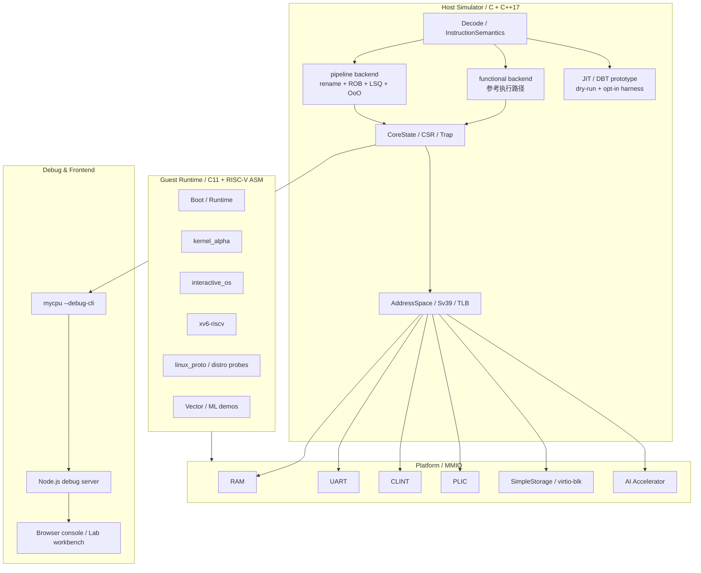

# 《计算机系统结构》课程项目结题报告

## 基于 RISC-V 的指令集模拟器设计与实现

| 项目 | 内容 |
|---|---|
| 课程 | 计算机系统结构 |
| 项目名称 | myCPU / my_visual_CPU |
| 项目主题 | 基于 RISC-V 的指令集模拟器与系统级虚拟计算机平台 |
| 指导教师 | 王宇新 |
| 小组成员 | 梁家琦（20231071332，电计 2304）；杨皓宇（20231071522，电计 2303）；余健超（20231071430，电计 2303） |
| 报告日期 | 2026 年 5 月 9 日 |
| 仓库 | `steven123397/my_visual_CPU` |

> 说明：本报告面向课程结题与答辩总结，依据开题报告、当前仓库实现、README、设计文档和状态文档整理。课程结题并不意味着项目停止开发；仓库内 `docs/status/mainline_status.md` 等正式工程文档仍继续作为后续开发的实时事实来源。

## 摘要

本项目以《计算机系统结构》课程提出的“造一台虚拟计算机”为目标，从零开始实现了一套可运行、可调试、可验证的 RISC-V 系统模拟器。开题阶段的基本目标是完成一个能够运行裸机程序的指令集模拟器，覆盖 CPU 状态、取指译码执行、ELF / flat binary 加载、内存访问、UART / CLINT 外设、CSR、异常与中断，以及基础回归测试。结题时，项目已经从单一功能级模拟器演进为一套持续发展的系统级模拟器工程：它不仅支持 RV64I / RV64M 为主体的指令执行、M / S / U 三级特权模式、Sv39 虚拟内存、UART / CLINT / PLIC / 块设备平台，还形成了 `functional` 参考后端与 `pipeline` 微架构后端并存的双执行模型，并在 guest 侧完成了自制 `kernel_alpha` 内核、交互式 monitor、向量 / ML workload、`xv6-riscv` bring-up、Linux-facing boot/probe 路径等一系列系统级验证。

在工程实现上，项目从早期 C 原型逐步重构为模块化 C++17 架构，核心边界清晰划分为 ISA 语义、CPU/CSR 状态、地址空间、总线与设备、执行后端、平台组装、guest runtime、debug 协议和前端展示等模块。项目坚持 `reference-first` 的实现方法：以共享 `InstructionSemantics + functional backend` 作为 ISA 语义真值来源，`pipeline`、JIT/DBT 原型和前端观察面均消费同一套语义与只读快照，避免多套语义分叉。结题时，仓库已拥有数百个测试与 smoke 入口，覆盖 asm 指令级、host 单元、guest 系统级、pipeline、frontend、Spike 外部差分等多维验证。

从课程目标看，本项目已经完成并显著超过开题报告中的基础要求：它不仅能运行裸机程序和串口输出，还具备特权级、虚拟内存、系统中断、块设备、自制 OS bring-up、外部 workload、浏览器可视化调试台、AI accelerator 设备原型、JIT/DBT 研究原型等扩展能力。项目最终形成了一套可用于课程展示、后续操作系统实验、微结构研究和系统软件 bring-up 的完整实验平台。

**关键词：** RISC-V；指令集模拟器；系统结构；虚拟内存；特权级；流水线；OS bring-up；可视化调试；验证体系。

## 1. 项目背景与意义

计算机系统结构课程的核心难点在于：许多机制在教材中以概念形式出现，例如 ISA、寄存器、访存、异常、中断、特权级、虚拟内存和外设接口，但如果只停留在课堂推导，很难真正理解它们在一台“能运行程序的计算机”中如何协同工作。开题报告中提出，本课程项目希望通过“造一台虚拟计算机”的方式，将学习视角从“使用计算机”转向“设计计算机”。

成熟模拟器如 Bochs、QEMU、Spike 等已经具备完整能力，但它们的代码规模与工程复杂度较高，不适合作为初学者从零理解处理器内部机制的第一入口。因此，本项目选择 RISC-V 作为目标架构，一方面利用 RISC-V 规范公开、结构清晰、教育友好的特点，另一方面通过自主实现控制复杂度，优先形成一个正确、可调试、可扩展的参考模型，再逐步向系统级平台和微结构模型扩展。

项目的课程意义主要体现在以下几个方面：

1. 把 ISA 语义从抽象规范落实为可执行代码，理解指令格式、立即数拼接、寄存器写回、访存大小、符号扩展和控制流更新等细节。
2. 把 CPU 执行流程从“取指、译码、执行”的概念落实为可观察的执行后端，并进一步扩展到流水线、重命名、ROB、LSQ 和乱序执行边界。
3. 把中断、异常、CSR、特权级和虚拟内存串成完整系统路径，而不是孤立实现单个指令或单个寄存器。
4. 把“计算机系统结构”与“操作系统”衔接起来，让 guest 内核、系统调用、页表、设备驱动、终端交互和外部 workload 在同一模拟平台上运行。
5. 建立自动化验证体系，用可重复的测试和外部差分降低系统级项目常见的“能跑但不可信”风险。

## 2. 开题目标回顾

开题报告中，项目被定义为“基于 RISC-V 的指令集模拟器设计与实现”，目标是实现一个可运行裸机程序的 `myCPU` 模拟器，并为后续 OS bring-up 与微结构扩展预留结构基础。

### 2.1 知识目标

开题报告提出的知识目标包括：

- 理解 RISC-V 指令集结构及执行模型。
- 掌握 CPU 的 Fetch-Decode-Execute 基本执行流程。
- 理解寄存器、内存、CSR、中断等核心机制。

### 2.2 技能目标

开题报告提出的技能目标包括：

- 使用 C/C++ 实现基础指令集模拟器。
- 解析 ELF 程序并完成加载执行。
- 实现简单外设模拟，例如 UART 和定时器。

### 2.3 项目成果目标

开题报告提出的成果目标包括：

- 实现一个可运行裸机程序的模拟器。
- 支持基础指令执行、内存访问和串口输出。
- 具备扩展中断与操作系统运行能力。

### 2.4 扩展规划

开题报告还提出了若干扩展阶段：

- 第一阶段：梳理现有 C 原型，完成 C++ 模块化重构基础。
- 第二阶段：补强 RV64I / RV64M、CSR、trap、特权级和权限切换。
- 第三阶段：实现 Sv39 页表、页故障、TLB 和系统加载流程。
- 第四阶段：形成 OS bring-up 平台，支持小型自制操作系统内核启动。
- 第五阶段：为未来多周期、流水线和乱序执行研究预留结构基础。

结题时，上述基础目标和扩展阶段均已落地，并在多个方向上继续向课程以外的系统级工程推进。

## 3. 总体完成情况

### 3.1 结题判断

从《计算机系统结构》课程大作业角度，本项目已经可以结题。理由如下：

- 基础指令集模拟器已经完成，能够执行 RISC-V 程序并维护架构状态。
- 程序加载、内存访问、串口输出、定时器、中断控制器、块设备等平台能力已经落地。
- CSR、trap、M / S / U 特权级、Sv39 虚拟内存、TLB、page fault 等系统结构能力已经形成稳定实现。
- 自制 guest 内核 `kernel_alpha` 已完成核心 bring-up，并形成正向与负向回归基线。
- `xv6-riscv` 已能在真实 `virtio-blk` board path 上稳定到 shell。
- Linux-facing boot/probe 路径已经具备 flat image、DTB、rootfs、串口 shell 和多类 Linux userland 合同验证。
- `pipeline` 后端已经从顺序执行演进到 `rename + ROB + LSQ +` 最小真实乱序执行模型。
- 浏览器前端已经能以可视化方式展示 pipeline、寄存器、CSR、平台设备、终端和 workload 状态。
- 测试体系已经从少量手工样例扩展为 asm / unit / host / guest / pipeline / frontend / Spike 差分等多层验证。

因此，项目不仅达到了开题报告中“可运行裸机程序的模拟器”的基础目标，也完成了“支撑小型 OS bring-up”和“为后续微结构扩展预留方向”的扩展目标。

### 3.2 开题目标与结题成果对照

| 开题目标 | 结题完成情况 | 说明 |
|---|---|---|
| 实现 RISC-V 指令集模拟器 | 已完成并扩展 | 当前以 RV64I / RV64M 为主体，并按系统 bring-up 需要扩展了原子、浮点、压缩、V-lite 向量等语义和回归入口。 |
| 支持 Fetch-Decode-Execute 主循环 | 已完成 | `functional` 后端作为参考执行路径，`pipeline` 后端作为微结构执行路径。 |
| 支持 ELF64 加载 | 已完成 | 支持 ELF 可加载段装载、入口设置和边界检查。 |
| 支持 flat binary 加载 | 已完成 | 支持指定基地址加载平坦二进制，用于最小 boot、SBI shim、Linux-facing 镜像路径等。 |
| 支持物理内存与地址检查 | 已完成 | 已形成 `AddressSpace -> Bus -> RAM/Device` 的统一访存路径。 |
| 支持 UART | 已完成并集成前端 | UART 同时服务裸机输出、guest monitor、Linux serial console 和浏览器 terminal。 |
| 支持 CLINT 定时器 | 已完成 | `mtime/mtimecmp` 与 `time` CSR、machine/supervisor timer interrupt 路径联动。 |
| 支持 CSR、ecall、ebreak、mret | 已完成并扩展 | 已覆盖 M / S / U、trap delegation、`mret/sret`、`satp`、`sfence.vma` 等系统路径。 |
| 支持异常与中断 | 已完成 | 已覆盖同步异常、timer interrupt、external interrupt、trap dispatch、返回路径和负向回归。 |
| 建立基础汇编测试 | 已完成并大幅扩展 | 已形成 asm、host、unit、guest、pipeline、frontend、Spike 差分等多层测试。 |
| 完成 C++ 模块化重构 | 已完成 | 核心 simulator 已按 arch、exec、mem、devices、loader、platform、debug 等模块组织。 |
| 支持 M/S/U 特权级 | 已完成 | 已用于 guest kernel、user task、xv6/Linux 路径。 |
| 实现 Sv39 虚拟内存 | 已完成 | 包含三级页表、TLB、`sfence.vma`、page fault 和 guest VM helper。 |
| 支撑自制 OS bring-up | 已完成 | `kernel_alpha` 已完成 boot、PMM、Sv39、interrupt、storage 等核心链路。 |
| 为流水线/乱序研究预留方向 | 已完成并落地 | 已有 `pipeline` 后端，包含 branch predictor、rename、ROB、LSQ、最小 OoO execute。 |
| 形成技术文档与总结材料 | 已完成 | 仓库维护 README、AGENTS、design、status、plan、showcase 等文档体系；本报告作为课程结题材料。 |

## 4. 系统总体架构

项目最终形成了一个从 host simulator 到 guest runtime，再到浏览器前端与验证体系的完整闭环。总体结构如下：



该架构有几个关键特点：

- **语义集中**：共享 `InstructionSemantics` 是 ISA 语义真值来源，避免多个后端各自解释指令。
- **后端分离**：`functional` 负责正确性基线，`pipeline` 负责微结构调度、暂存、flush、rollback 和可观察性。
- **平台统一**：CPU 访存统一走 `CPU -> AddressSpace -> Bus -> RAM/Device`，guest 看到的是一致的地址空间和 MMIO 契约。
- **guest 可复用**：自制 guest runtime、kernel、monitor、xv6/Linux workload 都运行在同一平台抽象上。
- **观察只读**：debug CLI 和前端只消费 machine/backend/device 快照，不反向成为执行语义来源。
- **验证分层**：基础指令、系统路径、guest、pipeline、前端和外部 oracle 分层验证，避免靠单个“大测试”兜底。

## 5. 核心实现内容

### 5.1 ISA、译码与执行语义

项目以 RISC-V RV64 为核心，实现了基础整数、乘除、分支跳转、load/store、系统指令、CSR 访问等路径。开题阶段特别指出 B 型、J 型立即数拼接、符号扩展、`x0` 恒为 0、`jal/jalr` 返回地址、load/store 符号扩展等细节容易出错；最终实现中，这些语义被集中到共享语义层，并通过 asm 和 host smoke 反复验证。

当前实现不再是简单的“单文件解释器”，而是通过模块拆分支撑长期扩展：

- `myCPU/src/decode.*` 负责基础译码。
- `myCPU/src/exec/*_ops.*` 承接整数、控制流、访存、浮点、向量等语义分类。
- `InstructionSemantics` 作为 functional、pipeline、JIT/DBT 原型共享的语义入口。
- `functional` 后端作为 reference path，承担 ISA 正确性基线。
- `pipeline` 后端只消费共享语义，不复制第二套 ISA 解释器。

这种设计的收益是：当某条指令语义需要修复时，优先修共享语义层，所有后端和验证路径同步受益，避免“functional 对、pipeline 错”或“两边一起漂”的长期维护风险。

### 5.2 程序加载与内存系统

开题报告要求同时支持 ELF64 和 flat binary。当前项目已经完成这一目标，并将它扩展为更完整的加载与平台组装能力：

- ELF 路径：读取程序头，加载可加载段，设置入口地址。
- flat binary 路径：按指定地址直接写入内存，适合最小 boot、SBI shim 和 Linux-facing 镜像实验。
- payload / DTB / initrd 路径：为外部 workload 和 Linux-facing boot foundation 提供组合加载能力。
- reset / reload 合同：前端和 debug session 可以对 workload 进行 load、run、pause、step、reset、terminate 等操作。

内存系统从“连续数组模拟主存”扩展为更清晰的地址空间模型：

- `RAM` 负责普通内存读写。
- `Bus` 负责根据地址路由 RAM 或 MMIO device。
- `AddressSpace` 负责 CPU 侧统一访存入口。
- MMIO 设备按地址窗口注册，并显式处理访问宽度、非法偏移和 side effect。
- 访存错误通过 CPU/trap 路径形成可观察 fault，而不是静默失败。

这使项目能够支撑普通裸机程序、guest kernel、xv6、Linux-facing probe 和前端调试的统一执行路径。

### 5.3 CSR、异常、中断与特权级

开题阶段计划先覆盖 M-mode 基础路径，重点实现 `mstatus`、`misa`、`mie`、`mtvec`、`mepc`、`mcause`、`mtval`、`mip`、`cycle`、`time` 等 CSR，以及 `ecall`、`ebreak`、`mret`。结题时，该目标已经扩展为完整的 M / S / U 三级特权路径：

- 支持 machine、supervisor、user privilege。
- 支持 trap delegation，使部分异常/中断可委派到 S-mode。
- 支持 `mret`、`sret` 返回路径。
- 支持 timer interrupt、external interrupt 和同步异常。
- 支持 `satp`、Sv39 地址翻译和 `sfence.vma`。
- 支持 page fault、访问权限检查和 user/supervisor 隔离。

中断控制方面，项目实现了：

- **CLINT**：提供 `mtime/mtimecmp`，驱动 machine/supervisor timer interrupt。
- **PLIC**：提供最小外部中断控制器，当前接入 UART THRE interrupt 等路径。
- **UART**：承担串口输入输出和终端交互。
- **Storage / virtio-blk**：为 guest storage 和 xv6/Linux workload 提供块设备基础。

这一部分是项目从“能执行指令”走向“能运行系统软件”的关键。

### 5.4 Sv39 虚拟内存与 guest runtime

虚拟内存是开题报告第三阶段规划中的重点扩展。当前项目已经完成 Sv39 三级页表、TLB、page fault、`sfence.vma` 和 guest-side VM helper，并将其用于自制 guest kernel 与外部 workload。

guest runtime 侧已经具备以下基础设施：

- boot / start 汇编入口。
- early allocator 与 bitmap-backed PMM。
- Sv39 page table builder。
- `satp` 切换与 TLB 一致性维护。
- trap dispatch、interrupt handler 和 exception handler。
- demand-mapped fault 与可恢复 page fault 路径。
- supervisor 侧 user-page 访问验证。
- kernel/user 地址窗口 helper。

这些能力让项目不再停留在裸机程序层面，而是能够支撑一个具备内存管理、trap、中断、用户态和存储访问的最小内核。

### 5.5 自制 OS 内核 `kernel_alpha`

`kernel_alpha` 是项目 OS bring-up 能力的集中体现。它已经达到 Phase 1 核心完成态，正向输出固定为 `KMVPETDS`：

| 标记 | 含义 |
|---|---|
| `K` | 进入独立 kernel 入口 |
| `M` | memory / PMM 初始化完成 |
| `V` | 自建 Sv39 内核页表启用并稳定工作 |
| `P` | PLIC 最小 supervisor 初始化完成 |
| `E` | 第一次 supervisor external interrupt 到达 |
| `T` | 第一次 timer interrupt 到达 |
| `D` | storage readiness / metadata probe 完成 |
| `S` | `LBA 0` 读取和签名校验完成 |

同时，项目还维护了多条负向回归，覆盖 storage、PLIC、timer 等异常场景。例如：

- no media。
- device not ready。
- bad magic。
- bad block count。
- LBA range error。
- bad command。
- PLIC not ready。
- timer not ready。

这说明项目不是只展示一条“正好能跑”的 happy path，而是把设备错误、初始化失败和边界条件纳入了可重复验证。

### 5.6 执行后端与 pipeline 微结构

课程项目通常只要求实现功能级解释执行；本项目进一步实现了双后端结构：

- `functional`：顺序 reference backend，以 ISA 正确性为核心。
- `pipeline`：微结构 backend，以流水线状态、调度、提交和可观察性为核心。

当前 `pipeline` 后端已经具备以下能力：

- 单发射基础流水线。
- 最小分支预测：`jal` 静态 taken，条件分支使用 2-bit bimodal counter 与 target 记忆。
- register rename。
- reorder buffer (ROB)。
- load/store queue (LSQ)。
- non-memory 指令可先 execute，再等待 ROB head 顺序退休。
- RAM load/store 进入 LSQ 管理。
- store 只在 commit boundary 真正落到 RAM / MMIO。
- MMIO load/store 保持 non-speculative，避免投机副作用泄漏。
- mispredict、fault、rollback、flush 可观察。

当前 pipeline 的定位是“最小真实 OoO execute”，不是完整 superscalar 处理器。项目有意识地把复杂度控制在课程与工程可验证范围内：优先保证共享语义、提交边界和可观察性，而不是盲目追求更激进的 issue queue、selective replay 或 memory speculation。

### 5.7 平台设备与外部 workload

平台层已经从最小 UART / CLINT 扩展为能支持真实系统软件的 board profile：

- UART：串口输出、输入和 terminal。
- CLINT：平台时间和 timer interrupt。
- PLIC：外部中断控制器。
- SimpleStorage：自定义 MMIO block device。
- virtio-blk：用于更接近真实板级路径的块设备。
- AI Accelerator：独立 MMIO NPU / TPU-like 设备原型。

外部 workload 方面，项目已经完成多条重要路径：

- `xv6-riscv` 已在 `mycpu_virt + virtio-blk` board profile 上稳定到 shell。
- Linux-facing `linux_proto` 支持 flat SBI shim、Linux `Image`、DTB、rootfs 和启动寄存器布局。
- Linux fourth-stage harness 已扩展到 `timerfd-one-shot-readback-ok` 等多类 userland 合同。
- 浏览器前端可在配置真实 Linux `Image` 后提供 gated Linux Serial Console 路线。

这些成果已经超过开题报告中“为后续 OS bring-up 预留能力”的要求，实际形成了自制 OS、xv6 和 Linux-facing 路径并存的系统软件实验平台。

### 5.8 向量扩展、ML workload 与 AI accelerator

项目还扩展了系统结构课程中具有代表性的 AI / ML 方向：

- V-lite 向量指令子集。
- dot / GEMM / Conv / ReLU workload。
- `guest_vector_demo` 与 `guest_vector_cnn_demo`。
- 浏览器前端的向量寄存器、SEW / VL 和 workload 观察面。

在此基础上，项目进一步实现了独立 `MMIO NPU / TPU-like` AI accelerator 方向：

- scratchpad。
- DMA engine。
- submission queue / completion queue。
- graph package。
- bounded dynamic shape。
- `GEMM / CNN / tiny model / attention-like` 受限 workload。
- timed-simple no-overlap profile。
- device `profile_summary()`。
- host-side task spec importer。
- guest bridge workload 与 reset / fault / counter 合同。

这部分已经明显超出课程基础要求，但对“系统结构”课程很有价值：它展示了 CPU、设备、DMA、队列、profile、guest 可见 MMIO ABI 之间如何形成一个简化但可信的硬件加速器模型。

### 5.9 JIT / DBT 原型与后续研究基础

开题报告第五阶段提出“为未来多周期、流水线和乱序执行研究预留结构基础”。项目实际进一步推进到 JIT / DBT 研究原型：

- hot-path candidate 与 block planning。
- typed DBT IR。
- translator dry-run。
- IR semantic differential。
- helper planning / replay contract。
- IR lowering。
- executable memory policy。
- x86-64 host code emission v0。
- opt-in runtime harness。
- executable cache runtime hookup。
- runtime invalidation contract。
- metadata-only block cache。

需要强调的是，当前 JIT / DBT 仍是 opt-in / host-smoke-only / dry-run 为主的研究路径，不替换默认 `functional` 或 `pipeline` 后端，也不声明完整 workload-level JIT 已完成。这种边界控制体现了项目的工程纪律：先建立可观察、可验证、可回退的合同，再考虑默认 runtime 接入。

### 5.10 Debug CLI 与浏览器可视化前端

项目实现了 `mycpu --debug-cli` 单行 JSON 协议、Node.js debug server 和浏览器前端。当前调试链路为：

```text
browser
  -> frontend/app/*
  -> frontend/server/debug_server.mjs
      -> debug_server_runtime.mjs
           -> debug_cli_session.mjs
                -> mycpu --debug-cli
                     -> DebugSession
                     -> Machine
                     -> ExecutionBackend::debug_snapshot()
```

前端能力包括：

- workload 选择。
- backend 选择。
- Load / Run / Pause / Step / Reset / Terminate。
- pipeline stage cards 与 timeline。
- GPR / CSR 面板。
- trap / event / bus 观察。
- UART terminal。
- platform state。
- vector register panel。
- Linux Serial Console gated route。
- AI tiny model 参数化 demo。
- Post-Wave 7 Lab workbench 三栏实验台布局。

这条前端链路让课程答辩不再只能展示终端输出，而可以直接展示 CPU 内部状态、pipeline 流动、寄存器变化、串口交互和 workload 证据。

为方便答辩与远程查看，项目也在云服务器上部署了一套演示环境。部署方式较简单：远端 checkout 中构建 `mycpu` 和前端 workload 产物，由 systemd 启动 Node debug server，nginx 通过 HTTPS 反向代理到本机服务，并保留 Linux `Image`、rootfs、DTB、Spike 等运行资产在仓库外。该部分主要服务于展示和验收访问，不是本项目的核心研究内容。

## 6. 验证体系

### 6.1 验证设计原则

项目没有把“能跑通一次”当作完成标准，而是建立了分层验证体系。核心原则是：

- 小语义用 asm / unit test 锁住。
- 系统路径用 host smoke / guest smoke 锁住。
- 后端一致性用 functional 与 pipeline differential 锁住。
- 高风险架构语义用 Spike 外部 oracle 交叉验证。
- 前端与 debug 协议用 Node test 和 runtime characterization 验证。
- 真实 Linux / distro 资产保持 opt-in，避免仓库默认携带大镜像或把不可复现环境误报为默认事实。

### 6.2 当前测试规模

按 2026 年 5 月 9 日撰写时的 Git tracked 口径统计：

| 类别 | 文件数 | 行数 |
|---|---:|---:|
| Host simulator C/C++ | 165 | 28,393 |
| Guest runtime | 81 | 10,774 |
| Frontend | 43 | 18,388 |
| Tests | 160 | 59,490 |
| Docs | 33 | 8,801 |

同时，`myCPU/Makefile` 中已有 62 个显式 `test-*` 入口，覆盖：

- 指令级 asm 测试。
- host 单元测试。
- debug CLI smoke。
- pipeline smoke。
- backend differential。
- guest demos。
- xv6 smoke。
- Linux probe。
- AI accelerator smoke。
- Spike differential smoke。

### 6.3 代表性验证命令

课程验收或答辩前，建议根据时间选择以下命令组合：

```bash
cd myCPU
make test
make test-pipeline
make test-host-debug_cli_smoke
make test-host-interactive_terminal_smoke
make test-host-xv6_boot_smoke
make test-host-xv6_shell_smoke
make test-host-run_debug_cli_probe
```

前端验证：

```bash
cd frontend
node --test
```

Spike 外部差分验证：

```bash
cd myCPU
make test-host-spike_differential_smoke

# 如本机安装 Spike，可运行真实外部差分：
make test-host-spike_differential
```

AI accelerator demo v1：

```bash
cd myCPU
python3 workloads/ai_proto/run_demo_v1.py
```

### 6.4 代表性演示路径

#### 演示路径一：基础指令与 pipeline 观察

1. 构建 `mycpu`。
2. 启动前端。
3. 选择基础 asm workload。
4. 切换到 `pipeline` backend。
5. 使用 Step Cycle / Step Commit 观察 pipeline stage、寄存器变化和提交行为。

#### 演示路径二：交互式 OS

1. 选择 `interactive_os_demo`。
2. 运行到串口 monitor 提示符。
3. 输入 `help`、`time`、`regs`、`pagewalk`、`disk info` 等命令。
4. 展示 guest terminal、页表查询、设备访问和 CPU 状态同步变化。

#### 演示路径三：自制内核 `kernel_alpha`

1. 运行 `kernel_alpha_demo`。
2. 观察输出 `KMVPETDS`。
3. 解释从 kernel entry、PMM、Sv39、PLIC、timer 到 storage 的 bring-up 链路。
4. 可补充展示 storage / timer / PLIC 的负向 demo。

#### 演示路径四：xv6 / Linux-facing 能力

1. 运行 `xv6` shell smoke，展示真实外部 workload。
2. 如环境具备真实 Linux `Image`，配置 `MYCPU_LINUX_PROTO_CONSOLE_IMAGE` 后展示 gated Linux Serial Console。
3. 说明真实 Linux / distro 镜像不进仓库，默认路径保持 fail-closed。

#### 演示路径五：向量与 AI accelerator

1. 运行 `guest_vector_cnn_demo`，观察 `conv -> relu` workload。
2. 运行 AI demo v1，展示 bounded task spec 到 graph package、profile summary、fail-closed 样例的路径。
3. 说明该方向是课程外的系统结构扩展，不等同于通用模型上传或完整 NPU driver。

## 7. 关键技术问题与解决方案

### 7.1 指令立即数与执行语义容易出错

RISC-V 的 B 型、J 型立即数分散在多个 bit field 中，符号扩展和目标地址计算很容易出现 off-by-one 或位拼接错误。项目通过以下方式解决：

- 将译码逻辑集中整理。
- 使用最小 asm 样例覆盖跳转、分支、立即数和返回地址。
- 把执行语义集中到共享语义层。
- 通过 functional / pipeline differential 避免后端语义分叉。

### 7.2 trap / interrupt 状态保存复杂

异常与中断路径涉及 `mstatus/sstatus`、`mepc/sepc`、`mcause/scause`、`mtval/stval`、特权级切换和返回路径，调试难度高。项目采取的策略是：

- 将 trap 入口、trap 返回、CSR 修改和 delegation 逻辑模块化。
- 先用最小 supervisor demo 验证，再扩大到 kernel alpha。
- 建立 timer、external interrupt、page fault、storage error 等正负路径回归。
- 用 Spike final-state / checkpoint 差分补强高风险架构语义。

### 7.3 MMIO 副作用与 pipeline 投机执行冲突

pipeline 后端引入 rename、ROB、LSQ 后，必须避免 MMIO store 在投机阶段提前生效，也要避免 MMIO load 被错误投机。项目在设计上明确：

- RAM load/store 可进入 LSQ 管理。
- store 只在 commit boundary 真正落到 RAM / MMIO。
- MMIO load 保持 non-speculative。
- MMIO store 不允许在投机阶段泄漏副作用。
- debug snapshot 只观察真实状态，不制造第二套执行语义。

这一设计保证了微结构扩展不会破坏 guest 可见行为。

### 7.4 虚拟内存与 page fault 调试困难

Sv39 涉及多级页表、PTE flags、权限检查、TLB、`satp`、`sfence.vma` 和不同访问类型的 fault。项目通过以下方式降低复杂度：

- 先建立 guest-side page table builder 和最小映射。
- 再引入 TLB 与 `sfence.vma`。
- 将 page fault 分为 fetch/load/store 等类型分别验证。
- 在 `interactive_os` 中加入 `pagewalk` / `pte dump` 等观察命令。
- 通过 host 和 guest 回归锁定边界。

### 7.5 系统级 workload bring-up 周期长

相比裸机测试，xv6 和 Linux-facing workload 更容易因为一个小语义缺口卡住，而且错误现象常表现为“没有输出”或“长时间等待”。项目采用小步 probe 方法：

- 将 workload bring-up 拆成可观察 checkpoint。
- 用 debug CLI probe 固定 prompt、UART marker、syscall/userland 合同。
- 对真实 Linux 镜像采用 opt-in 方式，不把外部资产混入默认仓库事实。
- 每次只推进一个最小边界，避免把多个变量混在一起调试。

### 7.6 工程规模增长后的文档与边界维护

项目从课程原型演进到系统级工程后，如果没有文档治理，很容易出现 README、设计文档、状态文档互相矛盾的问题。当前仓库采用：

- `AGENTS.md` 记录规则与工作流。
- `docs/design/` 记录长期设计边界。
- `docs/plan/` 记录执行计划与完成归档。
- `docs/status/` 记录实时状态、当前风险和下一步。
- `docs/showcase/` 记录展示材料、PPT、演讲稿和结题报告。

本结题报告作为课程交付物收口在 `docs/showcase/`，不替代上述工程文档。

## 8. 工程规模与成果沉淀

### 8.1 代码与文档规模

截至本报告撰写时，项目已经形成较完整的工程结构：

- Host simulator：C / C++17，模块化组织。
- Guest runtime：C11 + RISC-V assembly。
- Frontend：原生 JavaScript / CSS / HTML + Node.js debug server。
- Workload：asm、guest demo、xv6、Linux proto、AI proto。
- 文档：background、design、plan、status、showcase。
- Git 历史：245+ 次提交。

这说明项目已经不是一次性脚本或单文件课程作业，而是一套可持续维护的系统模拟器工程。

### 8.2 目录结构

```text
my_visual_CPU/
├── AGENTS.md                         # 仓库总览、规则和默认工作流
├── README.md                         # 面向读者的项目概览
├── myCPU/                            # 模拟器主体、guest runtime、测试与 workload
│   ├── src/                          # simulator C/C++ 源码
│   ├── guest/                        # guest runtime 与 demos
│   ├── tests/                        # asm / unit / host / guest 测试
│   └── workloads/                    # xv6 / linux_proto / ai_proto 等 workload
├── frontend/                         # Node debug server 与浏览器前端
├── docs/                             # background / design / plan / status / showcase
│   └── showcase/                     # 结题报告、PPT、演讲稿、截图与展示页
├── deploy/                           # 远端部署支架
└── README.md
```

### 8.3 主要成果清单

1. 完成一套自主设计的 RISC-V 系统模拟器。
2. 完成从 C 原型到模块化 C++17 架构的结构升级。
3. 完成 `functional` 参考后端与 `pipeline` 微结构后端。
4. 完成 ELF64 / flat binary / payload / DTB 等加载能力。
5. 完成 UART、CLINT、PLIC、storage、virtio-blk、AI accelerator 等设备路径。
6. 完成 CSR、trap、M / S / U 特权级、delegation、timer/external interrupt。
7. 完成 Sv39、TLB、`sfence.vma`、page fault 和 guest VM helper。
8. 完成自制 `kernel_alpha` 内核核心 bring-up。
9. 完成交互式 guest monitor 与浏览器 terminal 闭环。
10. 完成向量 V-lite 与固定 ML workload。
11. 完成 `xv6-riscv` shell bring-up 和 Linux-facing probe 路径。
12. 完成浏览器可视化调试台与 Lab workbench。
13. 完成 Spike 外部 final-state differential 设计与入口。
14. 完成 AI accelerator 设备原型与 demo v1。
15. 完成 JIT / DBT 研究原型的多层 dry-run / opt-in contract。
16. 完成分层测试、设计文档、状态文档和展示材料。

## 9. 团队协作与实现过程

开题报告中规划采用“按子系统负责 + 联调交叉验收”的方式开展。实际开发中，仓库主线主要由梁家琦集中维护和提交，以减少多人直接改同一主干带来的冲突；但代码实现、测试设计和联调验收按模块分工推进。Git 历史中保留了 `phase1-stable`、`phase2-stable` 等阶段性 tag，用于标记课程项目从基础模拟器到系统级平台的关键稳定节点。

三位成员的主要分工如下：

| 成员 | 主要负责内容 |
|---|---|
| 梁家琦 | 负责仓库主线维护、总体架构整合、ISA / CSR / trap / 内存与设备平台、自制 guest runtime、前端调试链路、文档整理和最终联调。 |
| 杨皓宇 | 负责流水线与微结构方向，包括 pipeline backend、分支预测、rename、ROB、LSQ、提交边界、flush / rollback 和相关可观察状态。 |
| 余健超 | 负责测试体系建设，包括 asm 指令级测试、unit / host smoke、guest smoke、pipeline 回归、frontend 测试、Spike differential 和验收命令整理。 |

开题阶段将任务概括划分为：

- CPU 核心与指令执行。
- 内存、装载与设备平台。
- CSR、trap/interrupt 与测试验证。

最终项目实际演进也基本遵循这一思路，但随着功能扩展，协作对象从最初的 3 个基础子系统扩展为更细的工程边界：

| 方向 | 最终沉淀 |
|---|---|
| CPU / ISA | 解码、共享语义、functional backend、pipeline backend、JIT/DBT 原型 |
| 内存 / 平台 | RAM、AddressSpace、Bus、MMIO、UART、CLINT、PLIC、storage、virtio |
| 系统软件 | guest runtime、kernel_alpha、interactive_os、xv6、linux_proto |
| 验证 | asm、unit、host smoke、guest smoke、pipeline、frontend、Spike differential |
| 展示 | debug CLI、Node server、browser frontend、showcase 文档 |
| 工程治理 | AGENTS、design、plan、status、history_plan、README |

项目开发过程中，Git 版本管理、分支隔离、回归测试和文档同步成为主要协作手段。尤其是中后期，项目规模已经超过普通课程作业，必须通过明确的模块边界和验证入口来避免多人协作时的接口漂移。

## 10. 项目亮点

### 10.1 从“指令解释器”扩展为“系统模拟器”

许多课程项目完成到“能跑 hello world”已经结束，而本项目进一步把 CPU、内存、特权级、虚拟内存、中断、设备、guest kernel 和前端观察串成完整链路。这使它更接近真正的系统结构实验平台。

### 10.2 reference-first 的工程方法

项目始终保留 `functional` reference path，并将共享语义作为真值来源。pipeline、JIT/DBT 和前端都不能复制第二套 ISA 解释。这种方法显著降低了复杂系统中语义漂移的风险。

### 10.3 最小但真实的乱序执行模型

`pipeline` 后端不是静态演示动画，而是真实参与执行的 backend。它具备 rename、ROB、LSQ、commit boundary 和最小 OoO execute，同时对 MMIO 和异常保持保守边界，体现了课程中微结构与架构语义之间的关系。

### 10.4 系统软件 bring-up 形成闭环

项目不仅有自制 `kernel_alpha`，还能推进到 `xv6-riscv` shell 与 Linux-facing probe。这说明模拟器的接口已经足以承载真实系统软件，而不是只服务人工构造的最小样例。

### 10.5 可视化调试提升展示与理解效率

浏览器前端将 pipeline、寄存器、CSR、平台设备、终端和 workload 状态统一展示，降低了答辩和调试门槛。对系统结构课程而言，这比单纯终端输出更能解释 CPU 内部机制。

### 10.6 验证体系覆盖面广

项目在测试上投入较多，从 asm 小样例到 Spike 外部差分，从 guest demo 到 frontend Node test，覆盖了多层风险。对于系统级模拟器，验证体系本身就是重要成果。

### 10.7 课程外扩展具有研究价值

AI accelerator、JIT/DBT、标准 Linux 发行版方向、远端部署支架等内容已经超出课程基础要求，但它们都是沿系统结构主线自然扩展出的研究方向，为后续课程、实验室项目或个人作品集提供了基础。

## 11. 当前限制与后续计划

虽然从课程结题角度项目已经完成，但从长期工程角度仍有一些明确边界和未完成方向。

### 11.1 当前限制

- 默认 backend 仍是 `functional`，JIT / DBT 不作为默认执行后端。
- `pipeline` 当前是最小真实 OoO execute，不是 superscalar 或完整工业级乱序核。
- L1D cache、shadow cache 和 observation 已有首轮收口，但 write-back、DMA coherence、multicore coherence 等未启动。
- Linux `Image` 和标准发行版 rootfs 不进入仓库，真实 Linux / distro runtime 仍需外部资产 opt-in。
- AI accelerator 当前是受限 task spec、bounded workload 和 timed-simple profile，不是通用 ONNX / PyTorch runtime，也不是 Linux-facing NPU driver。
- 前端是教学展示与实验工作台，不是通用 IDE、通用调试器或多用户云平台。

### 11.2 后续计划

课程结题后，项目可以继续沿以下方向推进：

1. **标准 Linux 发行版平台**
   继续推进外部 rootfs / Image / DTB 的 fail-closed runtime 合同，逐步扩大 shell、procfs、文件系统、进程控制和 userland ABI 证据。

2. **AI accelerator 后续硬化**
   在现有 task spec importer、profile summary、queue lifecycle 和 demo v1 基础上，继续推进更接近真实 NPU 的性能模型、更多 workload 和 guest/Linux-facing driver 边界。

3. **JIT / DBT 后续评估**
   在 opt-in host-smoke 可执行路径、runtime harness 和 invalidation 合同稳定后，再评估是否值得引入 workload-level scheduler 或默认 backend 接入。

4. **cache / memory-system 深化**
   基于现有 L1D / shadow cache / observation 合同，逐步评估 write-back、DMA coherence、cache maintenance 和 multicore 前置条件。

5. **前端产品化与远端部署**
   继续完善 Lab workbench、远端云服务器部署、真实 Linux console 和展示文档，使项目更适合对外演示和长期维护。

## 12. 课程收获

通过本项目，团队对计算机系统结构中的多个核心问题有了更具体的理解：

- 指令集不是抽象表格，而是每一条指令对寄存器、PC、内存、异常和权限状态的精确修改。
- 特权级和 trap 机制不是 OS 的附属概念，而是 CPU 与系统软件协作的核心接口。
- 虚拟内存不是单纯地址转换，而是页表、权限、TLB、fault、上下文切换和系统调用共同组成的机制。
- 外设不是简单的输入输出函数，而是通过 MMIO、访问宽度、状态位、中断和驱动协议暴露给 guest 的硬件合同。
- pipeline 微结构不能破坏架构语义；投机执行、store commit、MMIO side effect 和 rollback 必须有清晰边界。
- 系统级项目的主要难点不是写出某段代码，而是让代码、测试、文档、调试工具和边界判断长期保持一致。

这些收获正是课程项目制教学最有价值的部分：通过动手实现一台虚拟计算机，把教材中的分散概念组合成一个可以运行、可以观察、可以验证的系统。

## 13. 总结

本项目以“构建一台虚拟计算机”为目标，完成了一套基于 RISC-V 的指令集模拟器，并进一步扩展为具备特权级、虚拟内存、设备平台、自制 OS、外部 workload、pipeline 微结构、前端可视化和多层验证的系统模拟器工程。

从课程验收角度看，项目已经满足并超过开题报告目标：它能够运行裸机程序，支持 ELF / flat binary 加载、内存访问、UART 输出、CSR、trap、中断和定时器；同时已经实现 M / S / U、Sv39、guest kernel、xv6 shell、Linux-facing probe、pipeline 乱序后端、浏览器调试台和完整测试体系。

从工程延续角度看，项目仍有明确后续路线。课程结题只是该阶段学习目标的完成，不是仓库开发的终止。后续项目将继续围绕标准 Linux 发行版平台、AI accelerator、JIT/DBT、cache/memory-system 和前端产品化推进。但无论后续如何扩展，当前结题阶段已经形成了一套结构清晰、可运行、可调试、可验证的系统结构课程成果。

## 附录 A：推荐答辩展示顺序

1. 用 README 和本报告介绍项目目标：从 RISC-V 指令集模拟器扩展到系统级虚拟计算机。
2. 展示系统架构图，说明 host simulator、platform、guest runtime、debug frontend 的关系。
3. 运行基础 workload，展示指令执行、寄存器变化和 pipeline 可视化。
4. 运行 `interactive_os_demo`，展示浏览器 terminal 与 guest monitor 交互。
5. 运行或展示 `kernel_alpha` 输出 `KMVPETDS`，解释 OS bring-up 链路。
6. 展示 `xv6` / Linux-facing 路径作为超额成果。
7. 展示向量 / AI accelerator 或 JIT/DBT 原型作为后续扩展方向。
8. 说明测试体系和工程文档体系，强调项目不是一次性 demo。

## 附录 B：常用命令

构建模拟器：

```bash
cd myCPU
make
```

运行普通 ELF：

```bash
cd myCPU
./mycpu tests/asm/hello.elf
```

运行 pipeline backend：

```bash
cd myCPU
./mycpu --backend pipeline tests/asm/hello.elf
```

启动浏览器前端：

```bash
cd myCPU
make
cd ..
node frontend/server/debug_server.mjs
```

打开浏览器：

```text
http://127.0.0.1:4173
```

运行核心回归：

```bash
cd myCPU
make test
make test-pipeline
```

运行前端测试：

```bash
cd frontend
node --test
```
